# Hack Tooling Series – Git
**Date**: April 16, 2020  
**Location**: Zoom Meeting  
**Teacher**: Timothy Rediehs

## Resources
**Slides**
* []() -- TODO

**ACM Membership Attendance Portal**
* [Portal](http://members.uclaacm.com/login)

**Other useful resources** 

[The Missing Semester of Your CS Education: Git](https://missing.csail.mit.edu/2020/version-control/#snapshots)

[Pro Git](https://git-scm.com/book/en/v2)

Type `man gittutorial` into your command line, then <key>ENTER</key>.

---
## About Version Control
## Terms You'll Learn
* **Version Control**
* **Repository**
* **Commit**
* **Branch**
* **Merge**
* **Merge Conflict**
* **Fetch**
* **Pull**
* **Working tree**

## What is Git?
In short, Git lets you and your team take "snapshots" of your code at each step of development. These "snapshots" are represented as **commits** which contain the who, what, and when of your changes. We create a sort of "timeline" of your project that looks like this:

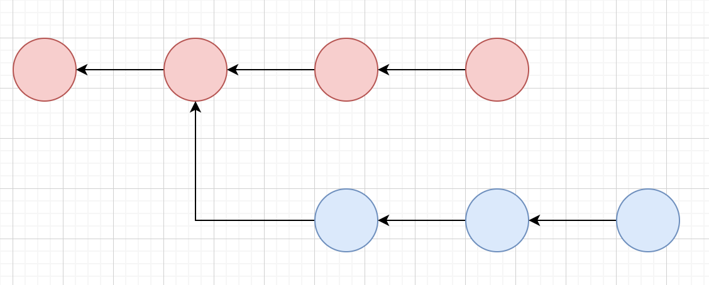

Each circle is a commit. Each arrow points from a commit to the commit it came from (called it's **parent**). In our "timeline" which we'll call a **graph** from now on, we know a few things:

1. There are no loops/cycles in the graph if you follow the arrows
2. Commits can point to one or more other commits.

We call this setup a **Directed Acyclic Graph**.

## Why Use Version Control
### Keeping A History of Your Code
One of the many nice things about version control is that it helps you keep track of how your code has changed. This is very useful, because it allows you to:

1. Find out **what** change was made in a file
   1. This is useful for bug hunting
2. Find out **who** wrote a section of code
3. Find out **when** a change was made
4. Revert unwanted changes
5. Feel secure against accidentally deleting your work
   1. No more commenting out code just to "keep it around just in case"

### Collaborate with Others Concurrently
Nowadays, we usually code in teams. Without version control, this becomes very difficult. If two people made changes, those changes would have to be manually combined. This would be an error prone disaster. Heaven forbid they modify the same file.

## Basic Git Operations
### git init
`git init` initializes a new repository.
### git add
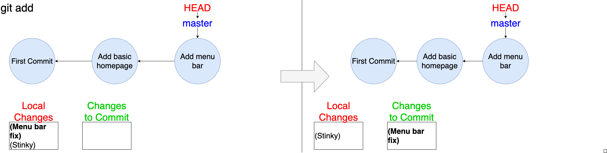

`git add` lets you select changes you want *intend* to commit. It is very important to note that you add *changes*. This means that you can pick a specific change in a file and add only that part of the changed file.

Pro tip: Use `git add -p` to manually select exactly which changes you want to stage.

### git commit
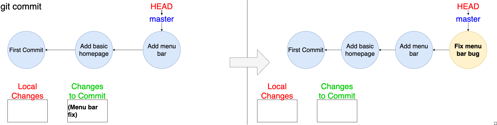

`git commit` takes the changes you added with `git add`, and adds them to your repository by packaging them in a **commit**. 

Pro tip: Use `git commit -a` to add/stage all modified and deleted files, and then commit.

## Branching and Merging
### git branch \<branch_name\>
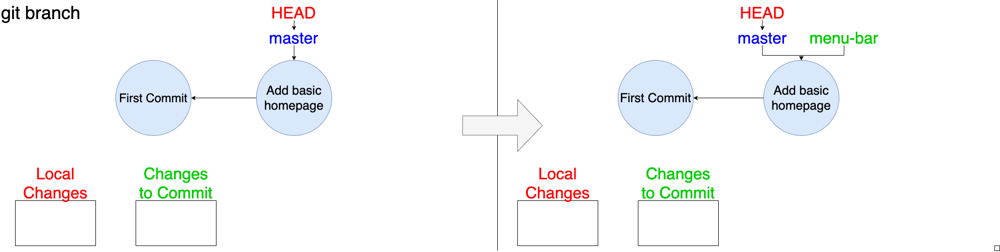

`git branch <branch_name>` creates a new branch that points to the commit indicated by HEAD (the "current branch").

### git checkout \<branch_name\>
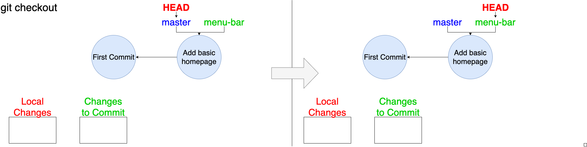

`git checkout <branch_name>` switches HEAD, which represents branch or commit that you are "at" locally, to the branch you specify. This can be any branch.

### git merge \<revision\>
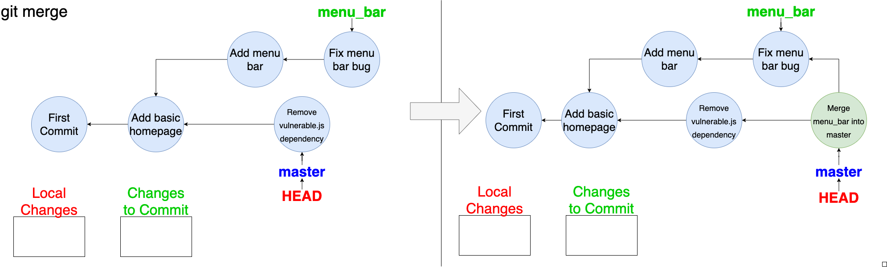

`git merge <branch_name>` (current branch is master) will combine the changes of \<branch_name\> and master.

### git rebase
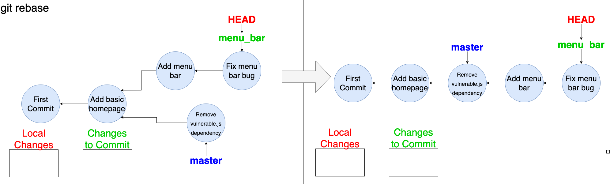

`git rebase master` will take all of the commits in your current branch and move them to the tip of master (like in the picture).

## View Status
### git status
This will show the differences between the HEAD commit (usually the latest one) and your current files
### git branch
This will list existing branches with a '*' next to the current one.
### git log
This command shows the commit logs. You'll see a list of commits that led to your current one.
### git diff
Shows the difference between your working tree (files on your computer) and a commit.
### git show
Can be used to view a specific object. For example, you can say `git show <commit_hash>` to show what a certain commit changed. You can find a commit hash by using `git log` and copying the big hexedecimal number by your commit. 

## Undo
## git commit --amend
This can change a commit message
## git reset head \<file\>
This unstages a file
## git checkout -- \<file\>
This discards a file's changes.
## git revert <commit hash>
Creates a new commit that undoes the changes of the commit indicated by <commit hash>

---
## Using Git
## Starting Up
### Installing Git
#### Linux
`apt install git`

#### MacOS
Install brew package manager
* `/bin/bash -c "$(curl -fsSL https://raw.githubusercontent.com/Homebrew/install/master/install.sh)"`

`brew install git`

#### Windows (or any of the above)
https://git-scm.com/downloads

### Setting Up Git
Type in your command line (*replace Gene Block's information with yours*)
```
git config --global user.name “Gene Block”
git config --global user.email “geneblock@ucla.edu”
```

### Creating a New Repository
Let's create a folder for our repository and then move inside it:

```
mkdir project
cd project
```

then, inside the folder, we can use the following command:

```
git init
```

`git init` – This command will create all of the data that git uses to keep track of your project. We call this a **repository**.

You should see the following in after executing `git init`:

```
Initialized empty Git repository in .git/
```

Congratulations, you're done with setup.

### Cloning an Existing Repository
Often times, we'll want to create a copy of an existing repository. You can do so with the following command:

`git clone <repository>`: This command copies a repository indicated by the `<repository>`. `<repository>` can be a path to a local folder, or even a url that points to a repository (on github for instance)!

If you want to clone a repository from git hub, you can get the URL here:

PICTURE OF GITHUB

and then use the clone command like this example (make sure to be in the directory that you want the project's folder to be inside of): 
```
git clone https://github.com/uclaacm/hack-tooling-series.git
```

## Making a First Commit
### Create a New File
Let's create a new file in our project called `math.py` put the following text in it using your favorite text editor:

```python
# math.py
def add(x, y):
    return x + y
```

We are ready to add this file to our repository!

### Staging Changes
We have made a change to our project. The next step is to tell Git **which changes we want to commit**. Well... what is there? Let's try finding out by using this command:
```
git status
```
We get back:
```
On branch master

No commits yet

Untracked files:
  (use "git add <file>..." to include in what will be committed)

	math.py

nothing added to commit but untracked files present (use "git add" to track)
```
Wow! Isn't Git so helpful? It tells us: `use "git add <file>..." to include in what will be committed`. Let's do that:
```
git add math.py
```
Now `git status` will show:
```
On branch master

No commits yet

Changes to be committed:
  (use "git rm --cached <file>..." to unstage)

	new file:   math.py
```

We have set our change to be committed! Mission Accomplished.

### Committing Changes
Now, let's actually commit our staged changes:
```
git commit
```
`git commit`: this will create a **commit** with all of your **staged** changes

Git will open up a command line text editor (probably Vim) for a **commit message**. These are descriptions of the changes you made. It's Vim... so:
1. Press 'i' for insert mode
2. Type message: Adds math file
3. Press ESC, then ':wq', then ENTER to quit Vim

You should see something like this after:
```
[master (root-commit) aeb900e] Adds math file
 1 file changed, 3 insertions(+)
 create mode 100644 math.py
```
We can use check on our progress with the following:
```
git log
```
to see our one commit:
```
commit aeb900e29558464ea38f4003daeae8cc797e9b70 (HEAD -> master)
Author: Emrakul Eldrazi <eeldrazi@g.ucla.edu>
Date:   Wed Apr 8 23:20:53 2020 -0700

    Adds math file
```
Our graph looks like this... very boring:


## Branching
Sometimes, we want develope in a separate branch. This is very useful because my work is somewhat isolated and won't mess anyone up*. Take the following example of two software devs: Emrakul Eldrazi and Kozilek Eldrazi

### Day 1: Subtraction Branch
Let's say we are a Software Engineer named Kozilek. We want to create a subtraction function. This time, we'll develop on a new branch called `subtraction`.
```
git branch subtraction
git checkout subtraction
```

Add the following code to `math.py` below the rest:

```py
def sub(x, y):
    return x - y
```
We can stage and commit our changes now with the message: "Adds subtraction function"

```
git add math.py
git commit
```
Now, we should be ready to merge our new changes into master! WRONG! Kozilek still has to get his changes approved by the Quality Assurance department. This sometimes takes time at his company.

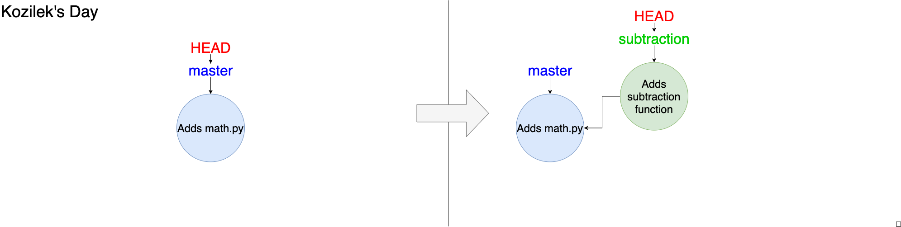

### Day 2: Sum-range Branch
We are now the Software Engineer Emrakul. Emrakul gets the following task: 

Write a function `sum_range(x, y)` that take two integers $x$ and $y$ such that $x < y$. The function returns the sum of x through y inclusive: $\sum_{i=x}^y i = x + (x+1) + ... + y$

Emrakul creates a new branch of of master for her change called `sum-range`:

```
git checkout -b sum-range
```

Then, she adds the following code to the bottom `math.py`

```py
def sum_range(x, y):
    return (y - x + 1) * (x + y) / 2
```

Finally, she commits with the message "adds sum_range function" her changes and patiently waits for Quality Assurance to approve them.

```
git commit -a
```

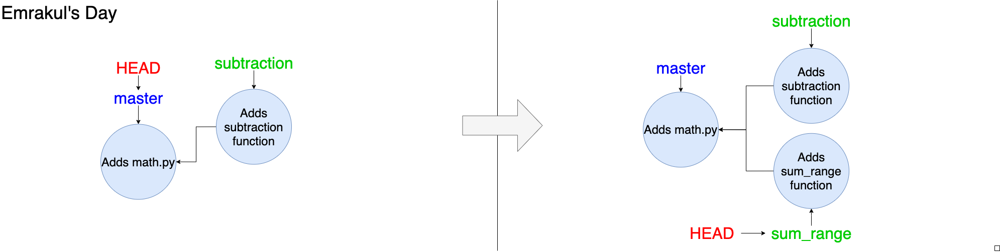

### Day 3: The Merge
Quality Assurance has approved both Kozilek and Emrakul's changes. Let's merge them.

First, we can merge Kozilek's change. Let's make sure we're on the master branch first.

```
git checkout master
```
Then, we can merge Kozilek's branch into master
```
git merge subtraction
```
Wow, that was easy. We now have the subtraction function in the master branch, and `git log` shows the following:

```
Author: Kozilek Eldrazi <kozilek@g.ucla.edu>
Date:   Sat Apr 11 20:16:51 2020 -0700

    Adds subtraction function

commit aeb900e29558464ea38f4003daeae8cc797e9b70
Author: Emrakul Eldrazi <emrakul@g.ucla.edu>
Date:   Wed Apr 8 23:20:53 2020 -0700

    Adds math file
```

#### Merge Conflicts
Let's merge in Emrakul's change!
```
git merge sum-range
```
Output:
```
Auto-merging math.py
CONFLICT (content): Merge conflict in math.py
Automatic merge failed; fix conflicts and then commit the result.
```

Oops... looks like Git is having trouble merging Emrakul's changes. If we run `git status` we see the following:

```
On branch master
You have unmerged paths.
  (fix conflicts and run "git commit")
  (use "git merge --abort" to abort the merge)

Unmerged paths:
  (use "git add <file>..." to mark resolution)

	both modified:   math.py

no changes added to commit (use "git add" and/or "git commit -a")
```

This happens sometimes, *don't let it scare you*. Let's **open the file** `math.py`:

```python
# math.py
def add(x, y):
    return x + y

<<<<<< HEAD
def sub(x, y):
    return x - y
======
def sum_range(x, y):
    return (y - x + 1) * (x + y) / 2
>>>>>> sum-range
```

Git is showing us which changes it's having trouble merging. The format is roughly like this:
```
<<<<<< HEAD
[Code on master]
======
[Code from branch]
>>>>>> branch_name
```
We want both functions. We can tell Git this by removing the annotations it added so the file looks like this:
```python
# math.py
def add(x, y):
    return x + y

def sub(x, y):
    return x - y

def sum_range(x, y):
    return (y - x + 1) * (x + y) / 2
```
Next, we commit the fixed file.
```
git add math.py
git commit math.py
```
After, we can remove the branches that we merged (this is optional)
```
git branch -d subtraction
git branch -d sum-range
```

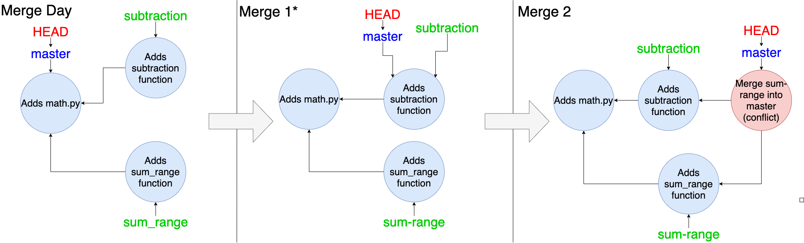

> *Note: The first merge doesn't create a merge commit as usual. This is because Git did a special kind of merge called a "fast-forward".

## Remote (Using Github)
### Setting Up Github
Git on one computer is great and all, but this would usually all happen using an online tool like Github. You can create a Github account by going to https://github.com/ (you're probably there already) and creating an account (school or personal email).

Then, get can create a new repo by clicking on the "new" button, then filling out a name and clicking "Create repository".

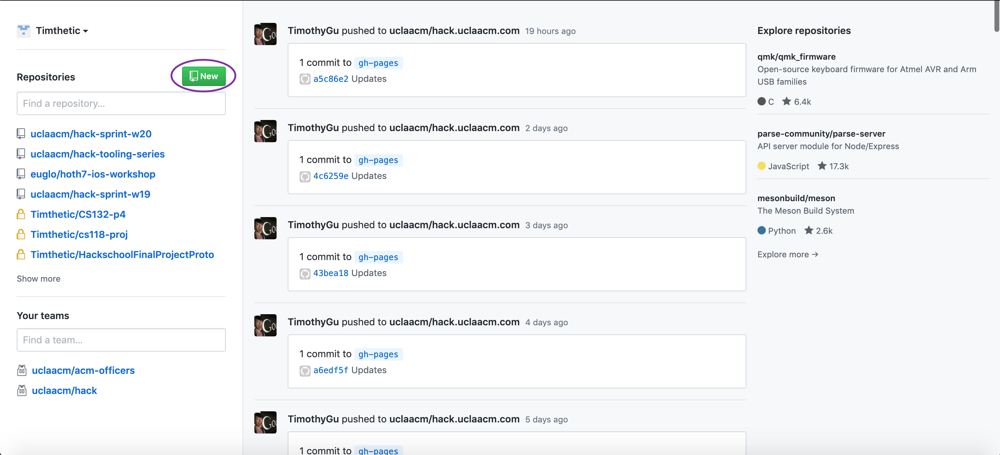

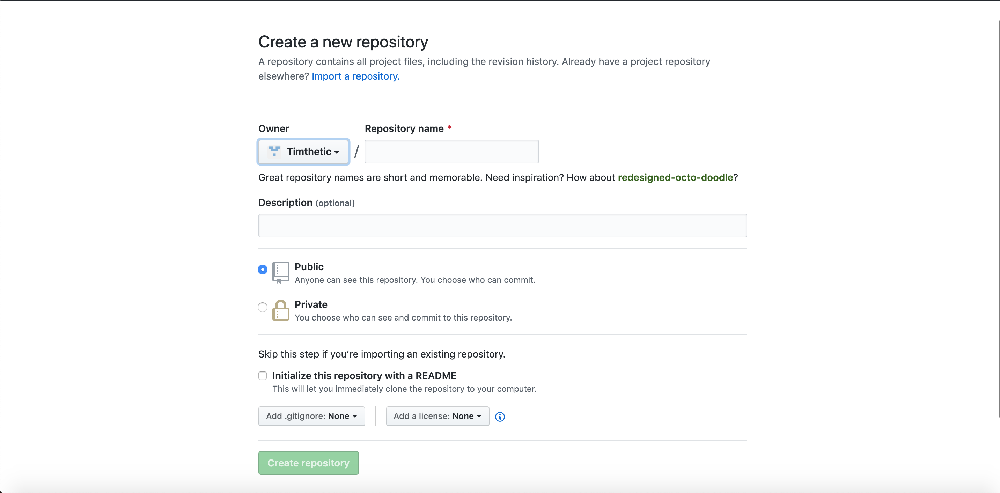

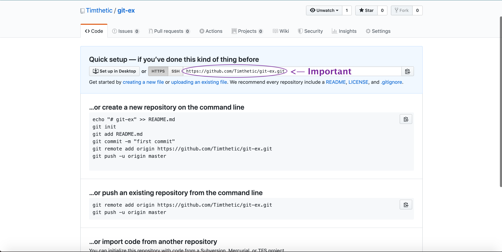

#### Uploading Your Code to GitHub
Then, git actually gives you instructions on how to upload the repository in the repository. However, let's say we didn't see that. Usually we following command to do that:
```
git push
```
Oh no! We get an error:
```
fatal: No configured push destination.
Either specify the URL from the command-line or configure a remote repository using

    git remote add <name> <url>

and then push using the remote name

    git push <name>

```

Ok, but **Git tells us what to do**. Let's try the first command with 
* \<name\> is **origin** 
* \<url\> is **copied from the URL on Github under "Quick Setup"**:

```
git remote add origin <url>
```

Great! Let's try the next one :
```
git push origin
```

Oh no! Another error:
```
fatal: The current branch master has no upstream branch.
To push the current branch and set the remote as upstream, use

    git push --set-upstream origin master
```

Great, let's use that command!
```
git push --set-upstream origin master
```
This command should succeed. Git will ask you for your Github username and password so it access your repository on Github. Fill that in.

In the end, the commands you need are the two below, but you only really need to remember `git push`, as these two will be displayed to you on Git or GitHub.
```
git remote add origin <URL_FROM_GITHUB>
git push -u origin master
```

After that, you should see `math.py` on github (you may have to refresh the page). Using git with Github works just like it does locally with an extra step. We also need to keep in mine **what is stored locally vs what is stored remotely**. Here are some useful commands that you'll use a lot:

* `git fetch`: retrieves data from the remote repository but doesn't change your working tree (local files).
* `git pull`: retrieves data from the remote repository and integrates those changes into your working tree (local files).
* `git push`: uploads the committed changes on your current branch to that branch on remote
* `git push -u origin <branch>`: use this to push a new branch to remote; it uploads your changes and creates the new branch there.

That concludes the tutorial!

## Bonus Information
### git stash
What if you're working on a feature, and someone asks you to look at their code on another branch? You're not ready to commit, but checking out to a new branch will cause you to lose your local changes (git will actually prevent you from checking out to another branch if this is the case)! We have a command to help. You can store local changes temporarily with `git stash`. Once you come back to your branch, you can use `git stash pop` to get your changes back.

Here's an example from the [documentation](https://git-scm.com/docs/git-stash#_examples)

```
# ... hack hack hack ...
$ git stash
$ edit emergency fix
$ git commit -a -m "Fix in a hurry"
$ git stash pop
# ... continue hacking ...
```
