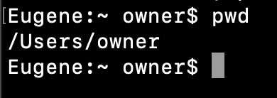
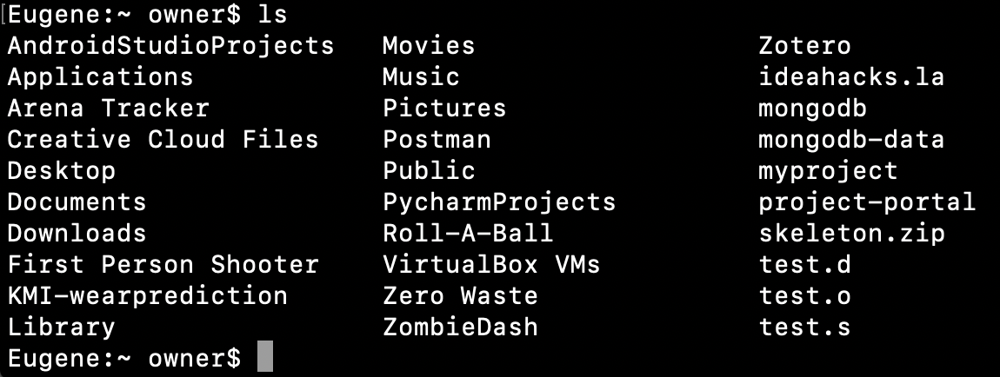

# Hack Tooling Series - Shell Scripting

**Date**: April 23, 2020\
**Location**: Zoom\
**Teachers**: Eugene Lo and Kristie Lim

## Resources

**Slides**
- [Slides](https://tinyurl.com/tooling-3)

**ACM Membership Attendance Portal**
- [Portal](https://members.uclaacm.com/login)

**Download Links - Bash for Windows**
- TODO

## Table of Contents
- <a href="#intro">Intro to shell and Bash</a>
- <a href="#commands">Useful commands</a>
- <a href="#tricks">Fun terminal tricks</a>
- <a href="#script">Shell Scripting</a>
- <a href="#applications">What you can do with shell scripting</a>

## 
Intro to shell and Bash

Before we dive headfirst into Bash commands and shell scripting, let's take some time to talk about what exactly a shell and Bash are.

### What is a shell?
In the olden times, back when Professor Eggert was but a wee lad, the only way to interact with a computer was through a Command Line Interface (CLI), an interface based solely on text. The user interface we are used to now, where we can interact with visual graphics on a screen with a mouse, is called a Graphical User Interface (GUI). A shell, therefore, was the CLI program they interacted with, which took commands from the keyboard and fed them to the operating system to perform. By doing this, the user could get access to OS resources, such as files and directories. Now, with GUI devices, the way we can simulate working with the shell is through a terminal emulator, which is a window that pops up and allows you to work with the shell. 

Over the years, there have been many shells, but they were more or less just software updates / extensions to the original Unix shell, the **Bourne shell**, along with its shell program _sh_. Other shells, like **Bash** (_bash_), **Z Shell** (_zsh_), and **KornShell** (_ksh_), have come to dominate modern operating system distributions, but since they all derived from the OG Bourne shell, the semantics are practically the same.

### What is Bash?

Today, we'll be honing in on **Bash**, since it is the default login shell for most Linux distributions and Mac (pre - Catalina OS update). The commands will be the same for any other Bourne shell descendant. Since Command Prompt and Powershell did not come from these, this means that my Windows friends will unfortunately have different commands. However, if you would like to still follow along, I have included a couple of downloads at the top of this readme for you to get Bash into your own system.

Bash is an abbreviation for the Bourne-again shell, which is a pun both on the Bourne shell and the fact that this shell is like a "rebirth" 👉👉. We like to have fun around here. 

New features have been added to Bash to make the developer's life a lot more productive. For example, users have access to their command history, or all the commands they have previously written. Additionally, commands can now be autocompleted. Finally, we're able to use ... 1-dimensional arrays for shell scripting!!!!!  
... I shouldn't have ended it on the lamest feature. My bad.

### Why use Bash?

Okay, I've given a long spiel about what Bash is, but why exactly should we use it? Well, first and foremost, it allows us to run programs and execute files on the terminal. These programs can be pre-built, such as Vim (a really popular text editor) and Emacs (a text editor), or programs you make yourself, whether it be a shell script or a C++ program. Executable files in Bash are often called commands, and commands are able to take a set of arguments as input, execute some code, and print out useful output. Furthermore, we are able to chain these commands together in a process called piping, where the output of one command is used as the input of the other, and this can make for some really powerful inline programs. 

Bash also has its own scripting language, so we are able to do shell scripting! With shell scripting, we can develop our own programs in Bash that run multiple commands, use variables, and use control structures, among other things. Shell scripting can do many things, such as automating routine tasks we perform, so they are definitely something worth learning.

All in all, it's a really essential developer tool. I would go as far as to say that using a computer without the terminal is like using a car without the steering wheel. Sure, you can drive straight, but there so much more you can do once you learn about turning left and right (you also stop being a literal safety hazard to pedestrians, but that's a different story). Working with the terminal is quicker because commands are run immediately. There are also some things you _have_ to do with the terminal because they can't be done with the graphical interface. Basically, learning Bash is worth your time.

However, as the overused quote from Spiderman goes, "With great power comes great responsibility." Sure, you now can run commands without getting hit with warnings, but this means you have to be *really* careful with what you type. Any command you type *can* and *will* be executed. If this command has unintended bad side effects, there is nothing stopping it from happening, so please be sure to proceed with caution.

## 
Useful commands

Great! Let's go head and learn about some really common and useful Bash commands that you will use very often. All of these commands in some way, shape, or form allow you to navigate through and work with files and directories (folders) in your local system.
- `pwd`
- `ls`
- `cd`
- `touch`
- `mkdir`
- `mv`
- `cp`
- `rm`
- `cat`
- `grep`
- `find`
- `wc`
- `open`

"But wait! What about the command -"\
Do not fret, my inner monologue. I have included a link to the top 25 Bash commands commonly used right [here](https://www.educative.io/blog/bash-shell-command-cheat-sheet). Without further ado, let's jump right into it! Open your preferred terminal emulator up, as long as it can run the Bash shell (or an alternative Unix shell). 

Note: I will be providing screenshots from my Mac OS laptop. Although the way the files and directories are laid out on your system may be different, the work flow is still the same.

### `pwd`
`pwd` stands for **print working directory**, and it does exactly that - it prints the directory you are currently working in.

What does this line mean exactly? To understand this more clearly, let's take a quick detour of how Bash commonly looks at files and directories.

In Bash, files and directories make a tree, where the parent (or root) directory of the tree is at the top, signified by "/". From there, it can contain, or branch out to, as many subdirectories as it wants, which in turn can branch out to more subdirectories, and so on. Eventually, we hit a leaf, which is where the branching stops, and this is a file. 

Therefore, by calling `pwd`, we are asking Bash to show us the path it took from the parent directory down each branch until we reach the directory we are currently at. In our case, we start at the parent root directory "/", then make our way to the Users directory, then finally at the owner directory, which is the one we are currently in.

### `ls`

Now, how do we find the contents of this current directory, aka what it branches out to? We do this by using the `ls` command, or **list**.

These are all of the contents within my `owner` directory. Some of these are files, which we can interact with, and some of these are subdirectories, which we can inspect further.

### `cd`

Now, you may be wondering how actually we are able inspect these subdirectories. We can do so by changing the directory we are currently in, using `cd`, which appropriately stands for **change directory**. Let's go ahead and change into the "Documents" folder.

## 
Fun terminal tricks

## 
Shell Scripting

## 
What you can do with shell scripting

