# Hack Tooling Series - Shell Scripting

**Date**: April 23, 2020\
**Location**: Zoom\
**Teachers**: Eugene Lo and Kristie Lim

## Resources

**Slides**
- [Slides](https://tinyurl.com/tooling-3)

**ACM Membership Attendance Portal**
- [Portal](https://members.uclaacm.com/login)

**Download Links - Bash for Windows**
- [git for Windows](https://gitforwindows.org/)
- [Ubuntu terminal](https://ubuntu.com/tutorials/tutorial-ubuntu-on-windows#1-overview)

## Table of Contents
- <a href="#intro">Intro to shell and Bash</a>
- <a href="#commands">Useful commands</a>
- <a href="#tricks">Fun terminal tricks</a>
- <a href="#script">Shell Scripting</a>
- <a href="#applications">What you can do with shell scripting</a>

## 
Intro to shell and Bash

Before we dive headfirst into Bash commands and shell scripting, let's take some time to talk about what exactly a shell and Bash are.

### What is a shell?
In the olden times, back when Professor Eggert was but a wee lad, the only way to interact with a computer was through a Command Line Interface (CLI), an interface based solely on text. The user interface we are used to now, where we can interact with visual graphics on a screen with a mouse, is called a Graphical User Interface (GUI). A shell, therefore, was the CLI program they interacted with, which took commands from the keyboard and fed them to the operating system to perform. By doing this, the user could get access to OS resources, such as files and directories. Now, with GUI devices, the way we can simulate working with the shell is through a terminal emulator, which is a window that pops up and allows you to work with the shell. 

Over the years, there have been many shells, but they were more or less just software updates / extensions to the original Unix shell, the **Bourne shell**, along with its shell program _sh_. Other shells, like **Bash** (_bash_), **Z Shell** (_zsh_), and **KornShell** (_ksh_), have come to dominate modern operating system distributions, but since they all derived from the OG Bourne shell, the semantics are practically the same.

### What is Bash?

Today, we'll be honing in on **Bash**, since it is the default login shell for most Linux distributions and Mac (pre - Catalina OS update). The commands will be the same for any other Bourne shell descendant. Since Command Prompt and Powershell did not come from these, this means that my Windows friends will unfortunately have different commands. However, if you would like to still follow along, I have included a couple of downloads at the top of this readme for you to get Bash into your own system.

Bash is an abbreviation for the Bourne-again shell, which is a pun both on the Bourne shell and the fact that this shell is like a "rebirth" 👉👉. We like to have fun around here. 

New features have been added to Bash to make the developer's life a lot more productive. For example, users have access to their command history, or all the commands they have previously written. Additionally, commands can now be autocompleted. Finally, we're able to use ... 1-dimensional arrays for shell scripting!!!!!  
... I shouldn't have ended it on the lamest feature. My bad.

### Why use Bash?

Okay, I've given a long spiel about what Bash is, but why exactly should we use it? Well, first and foremost, it allows us to run programs and execute files on the terminal. These programs can be pre-built, such as Vim (a really popular text editor) and Emacs (a text editor), or programs you make yourself, whether it be a shell script or a C++ program. Executable files in Bash are often called commands, and commands are able to take a set of arguments as input, execute some code, and print out useful output. Furthermore, we are able to chain these commands together in a process called piping, where the output of one command is used as the input of the other, and this can make for some really powerful inline programs. 

Bash also has its own scripting language, so we are able to do shell scripting! With shell scripting, we can develop our own programs in Bash that run multiple commands, use variables, and use control structures, among other things. Shell scripting can do many things, such as automating routine tasks we perform, so they are definitely something worth learning.

All in all, it's a really essential developer tool. I would go as far as to say that using a computer without the terminal is like using a car without the steering wheel. Sure, you can drive straight, but there so much more you can do once you learn about turning left and right (you also stop being a literal safety hazard to pedestrians, but that's a different story). Working with the terminal is quicker because commands are run immediately. There are also some things you _have_ to do with the terminal because they can't be done with the graphical interface. Basically, learning Bash is worth your time.

However, as the overused quote from Spiderman goes, "With great power comes great responsibility." Sure, you now can run commands without getting hit with warnings, but this means you have to be *really* careful with what you type. Any command you type *can* and *will* be executed. If this command has unintended bad side effects, there is nothing stopping it from happening, so please be sure to proceed with caution.

## 
Useful commands

Great! Let's go head and learn about some really common and useful Bash commands that you will use very often. All of these commands in some way, shape, or form allow you to navigate through and work with files and directories (folders) in your local system.
- `pwd`
- `ls`
- `cd`
- `touch`
- `mkdir`
- `mv`
- `cp`
- `rm`
- `cat`
- `grep`
- `find`
- `wc`
- `open`

"But wait! What about the command -"\
Do not fret, my inner monologue. I have included a link to the top 25 Bash commands commonly used right [here](https://www.educative.io/blog/bash-shell-command-cheat-sheet). Without further ado, let's jump right into it! Open your preferred terminal emulator up, as long as it can run the Bash shell (or an alternative Unix shell). 

Note: I will be providing screenshots from my Mac OS laptop. Although the way the files and directories are laid out on your system may be different, the work flow is still the same.

### `pwd`
`pwd` stands for **print working directory**, and it does exactly that - it prints the directory you are currently working in.

What does this line mean exactly? To understand this more clearly, let's take a quick detour of how Bash commonly looks at files and directories.

In Bash, files and directories make a tree, where the parent (or root) directory of the tree is at the top, signified by "/". From there, it can contain, or branch out to, as many subdirectories as it wants, which in turn can branch out to more subdirectories, and so on. Eventually, we hit a leaf, which is where the branching stops, and this is a file. 

Therefore, by calling `pwd`, we are asking Bash to show us the path it took from the parent directory down each branch until we reach the directory we are currently at. In our case, we start at the parent root directory "/", then make our way to the Users directory, then finally at the owner directory, which is the one we are currently in.

### `ls`

Now, how do we find the contents of this current directory, aka what it branches out to? We do this by using the `ls` command, or **list**.

These are all of the contents within my `owner` directory. Some of these are files, which we can interact with, and some of these are subdirectories, which we can inspect further.

With the `ls` command, you can also specify a particular directory you want to see the contents of. Let's do this to my "Desktop" directory to see what's inside.

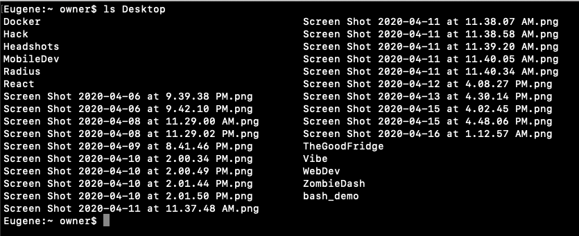

Sorry, I have a lot of screenshots.

### `cd`

We can also change the directory we are currently in, so that it's easier to work with the contents inside, using `cd`, which appropriately stands for **change directory**. Let's go ahead and change into the "Documents" folder.

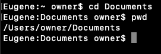

You'll notice that now, when we do `pwd`, we are standing in "Documents", which has become our current directory.

What we just specified now is called a **relative path**. Notice how we didn't have to type out the entire path to "Documents" (/Users/owner/Documents). This is because we defined a path related to the present working directory. If we had done `cd /Users/owner/Documents` instead (which does the exact same thing), we would have been using an **absolute path**, which specifies the location of a file in terms of the root directory "/", regardless of where you currently are. Let's go ahead and try that. I am going to `cd` into a directory I made specifically for this demo, which can be reached using the absolute file path "/Users/owner/Desktop/bash_demo".

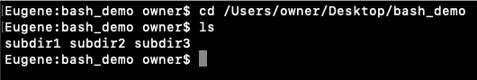

Aside: Remember how I said Bash added autocomplete as a feature? Once you type out "De" for "Desktop", you can press `tab` on your keyboard, and it will fill out the whole world for you. This only worked because "Desktop" is the only file/directory that starts with "De". Had you only typed in "D" before you pressed tab, it would not have known if you meant "Desktop", "Documents", or "Downloads". In this case, what you can do is double-tap `tab`, and it will show you all the files/directories that start with those letters.

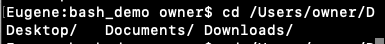

In Bash, there are a couple of symbols that take on a special meaning when used in conjunction with commands like `cd` (or `mv` and `cp`, which we will see later). These are some of the ones you will use most commonly:
- `.` (Current directory)
- `..` (Parent directory (the directory that contains this current directory))
- `/` (Root directory)
- `~` (Home directory (the default directory you start with. For my case, this was /Users/owner)

Here are all the commands and the file paths they go to:

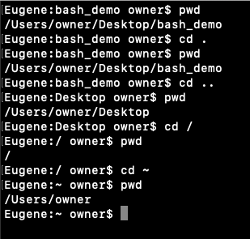

Now let's go back to "bash_demo". Wait!! Before you specify the same path again, remember when I said that a new feature with Bash is that you have access to the command history? You can navigate this command history with the up and down arrow keys. If you press up arrow a couple times, you will eventually find the `cd` command we did into bash_demo. Once you press enter, you're back in baby. To see a fill history of all the commands you have inputed, you can use the `history` command, which is what the up and down arrows are navigating through.

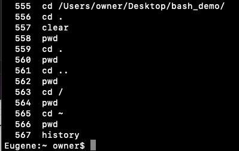

### `touch`

`touch` is how we create files. As a parameter, we provide the name of the file we want to create. In my limitless creativity, I am going to make a file called "file.txt".

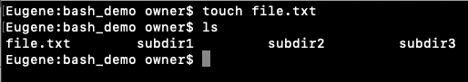

Great! When touch is called on a file name that does not exist in the directory yet, which we just saw, a file is created. Another use case for touch is to update the timestamp of existing files, but we won't get too much into that today.

We are also able to create multiple files in one line by specifying multiple parameters.

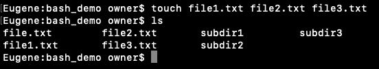

If you have used terminal text editors like Vim, Nano, or Emacs, you may also already know that when you open a file that does not exist yet, a file is created for you after you save it. This is another valid way to create files.

### mkdir

Likewise, the way to create directories in Bash is `mkdir`. As a parameter, you again specify the name of the directory you want to create.

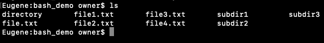

Similar to `touch`, you can input multiple parameters to create multiple directories in one line.

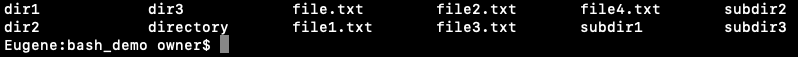

And because they're directories, you can `cd` into them and `touch` more files!

### mv

Next, we'll be going over the `mv` command (short for **move**), which has two main features: (1) moving files and directories into other directories, and (2) renaming files.

First, let's go over moving files and directories. With mv, you provide at least two parameters: the file/directory to move, and the directory to move it into.

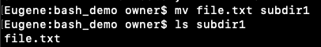

You can specify as many files/directories to move, but the last parameter has to be the directory to move it to.

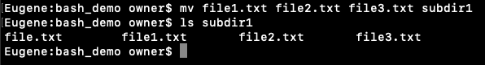

You may have noticed that all 3 files were named very similarly. As a shortcut, we could have used the wildcard "`*`", which is a placeholder for 0 or more of any character. Therefore, doing `mv file*.txt subdir` would have done the same thing. 

Next, let's go over the renaming aspect of `mv`. If you specify two parameters to `mv`, both of which are files, it will rename the file from the left parameter to the right parameter. Let's try that out.

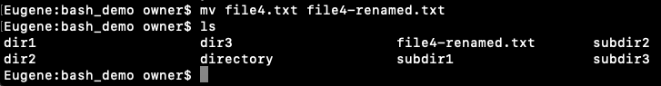

We can also combine these two features of `mv` into one command, where we move a file into directory and rename it in one command, like so:

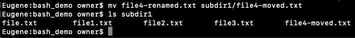

### `cp`
`cp`, short for **copy**, does exactly what mv does, but instead of moving the original files, it makes a copy and puts those into the destination directory. The format of the command is the same as the format for moving files into a directory for `mv`.

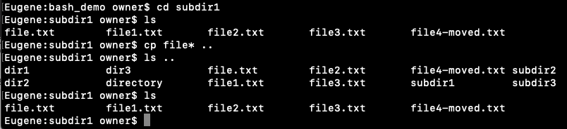

You may notice that when you try to copy a directory, the base command gives you an error.

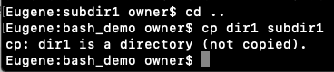

For directories, you need to add a little something extra. For more on that, look at the "Options" section below.

### rm

`rm`, or **remove**, does exactly what it says. Given a set of files as parameters, it will delete all of those files. For this example, I've prepared a little something extra.

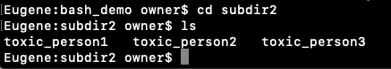

Oh no, toxic people!! I must dispose of them.

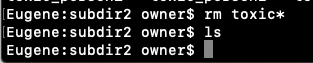

Great! I have now successfully removed toxic people from my life. If only it were that easy in real life.

Again, for removing directories, you have to add something extra. Stop the suspense already! Let's talk about options.

### Options

All Bash commands will have a set of flags, or **options**, associated to them, which extend their functionality. Although I will only be going over a couple of them today, you can find out about all of them by reading the manuals on the commands by using `man`. For example, to read about the `ls` command, you would type `man ls`. You can press `q` at any time to quit the manual.

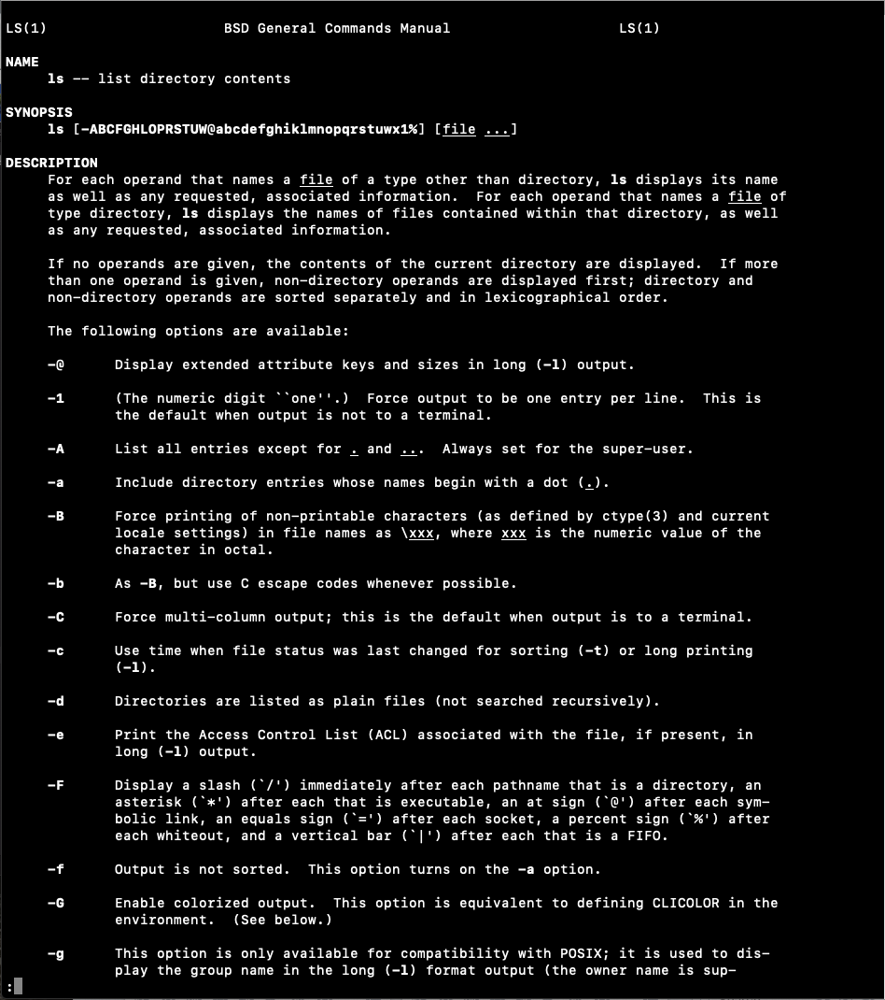

#### `cp -r`
For the `cp` command, we can specify the `-r` flag to be able to copy an entire directory somewhere else. Here, the "r" stands for "recursive", which means that along with copying the directory itself, it will also recursively copy any of the contents inside the directory, which could contain directories, which could also contain directories, and so on.

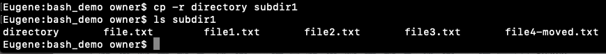

### `rm -rf`
For the `rm` command, we specify both the -r (recursive) and -f (force) commands to remove directories. - f means that it will "force" the removal of files and directories without asking for permission. Notice how if there are multiple options, we can shorten it to one "-" symbol and concatenate the options together.

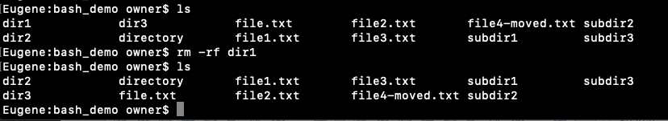

### `ls -l` and `ls -a`
Among many others, `ls` has two pretty useful options. By specifying `-l`, we are able to get much more detailed information about each file.

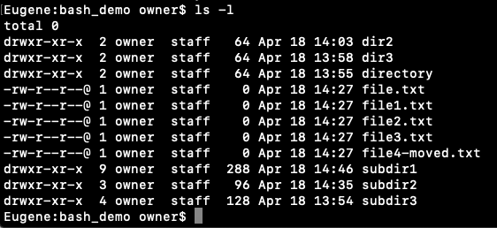

In these cases, ls -l shows that all of these files and directories were created by "owner" (aka me). It also shows the timestamp for when they were last modified, and the amount of space that each takes up, in bytes. Each of the files take up 0 bytes currently because I didn't add anything inside them, but if I go ahead and mofify "file.txt", this is what it looks like.

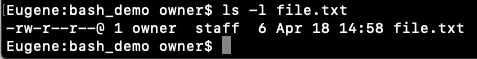

Notice how I have added 6 bytes of memory into the file by adding 6 characters. Notice also how the modify time has been updated to the newest time.

`ls -a`, on the other hand, allows us to see not only the visible files, but *hidden* files as well. Hidden files are denoted by a "`.`" at the beginning.

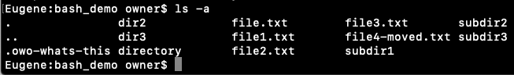

Now, we can see extra entries for the current directory "`.`", the parent directory "`..`", and... Owo, what's this? Another hidden file that I may or may have not added before this demo? I wonder what's inside the file.

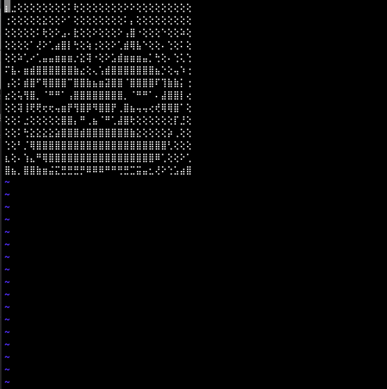

Cute.

These options can also be combined to give detailed information about all files in the current directory, hidden ones included.

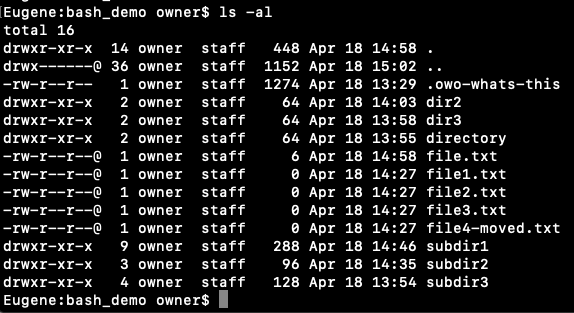

### Other useful commands
#### `clear`
Just like it sounds like, `clear` clears up your terminal. 'Nuff said.

#### `find`
There are a couple more options that I find pretty useful in my daily life. Among these are `find`, which will recursively find files starting from the directory you specify, and working its way into all the directories nested inside that directory as well.

Two flags that go well with find are `-name` and `-type`. Using `-name`, we can specify a keyword for a file or directory to look for, and it will output the relative paths to all of the files and directories that match the criteria.

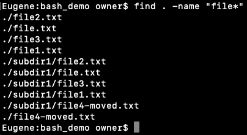

We can also use `-type` to specify the type of files we are looking for. For file, we do `-type f`, and for directories, we do `-type d`. For example, if we created a directory called "file-notreally" and repeated the last command, adding `type f` for files only, this directory would not show up.

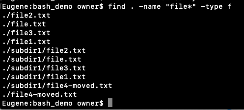

#### `cat`
`cat`, short for "concatenate", is used to display the contents of a file, or to concatenate files. When called on a file, it prints out what's inside the file right into terminal. 

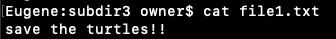

If I specify multiple files, it will print out the contents of both, concatenated one after the other.

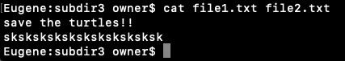

Finally, what I can do is take what is outputted to the terminal, and "redirect" it into another file. This redirection operator in Bash is denoted by `>`.

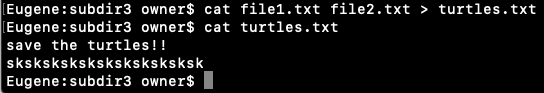

#### `grep`
`grep` is used to search text for patterns specified by the user. This is really useful if you need to find a string or pattern in a file, but don't exactly know where it is. For example, let's say I have a file, "bee.txt", that contains the entire *Bee Movie* script (don't ask me why). To create this command, we would call `grep`, then specify the pattern we're looking for, then the file in which to look for the pattern. Our entire command would now look like `grep "bee" bee.txt` (the quotes are optional). But wait, since `grep` is by default case-sensitive, this would ignore the parts of the script where the "b" is capitalized. To ignore case, we can specify the `-i` option.

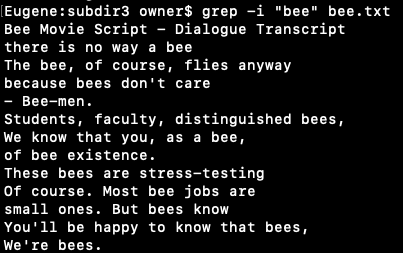

If we just wanted a numerical count of how many lines have this pattern, we can add the `-c` option.

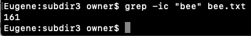

#### `wc`

Although the `-c` option for `grep` already does give us a line count, the `wc` gives us a lot more versality because we can specify what exactly we're counting. Without any options, calling `wc` on "bee.txt" would give us the following:

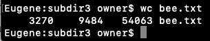

From left to right, `wc` gives us the line, word, and byte count of "bee.txt". In order to focus on one of these outputs, we can specify the `-l`, `-w`, and `-c` options, which output the line, word, and byte count only, respectively.

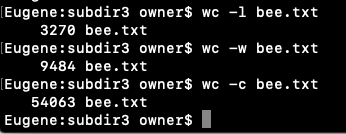

#### pipe `|`

Remember how before I said that using Bash, we are able to chain commands together? Well, that's done through the pipe command, denoted by | ! Using | , we can take the output of one command and use it as the input of another. Let's take the commands we've seen so far and use the pipe command to chain them together, in order to create a powerful inline program.

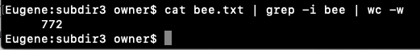

Using this, we now know that there are 772 words from lines related to "bee" in the *Bee Movie* script. Who asked for this? Literally no one? Too bad, now you know.

## 
Fun terminal tricks

Before we hop into shell scripting, I wanted to take some time to show you some neat terminal tips and tricks that can speed up the developing process on the terminal.

### Opening graphical applications

One cool thing that you can do in the terminal is open files directly in graphical applications. The most basic way to do this is using `open`, then the file you would like to open. This command opens the file as if you had double clicked it in your file system. For example, when I type in `open file1.txt`, it opens the file in the TextEdit application.

You can also specify the application to open it with the `-a` option. If you wanted to instead open the file in Sublime Text, you could type in `open file1.txt -a "Sublime Text"`, and it would do just that.

You can also do this for Visual Studio Code, with `open file1.txt -a "Visual Studio Code"`, but the people at Visual Studio Code provided us with a dedicated command to open it: `code`. Then, doing `code file1.txt` should open it successfully in VS Code as well.

Note: if `code` does not work for you, you may have to enable it by opening the Command Palette in VS Code and look for "Shell Command: Install 'code' command in PATH". 

### Aliases

Aliases are a cool way to set up shortcut commands for ourselves. Using aliases, we are basically providing another name for an exiting command, so that when we call our custom command, it calls the actual one behind the scenes. If you find yourself repeating a command that takes long to type, aliases might be a good idea. The syntax for setting up an alias is `alias alias_name = "command_to_run".

For example, in order to open a file in Sublime Text, we had to write out `open file1.txt -a "Sublime Text"`, which takes pretty long. We could instead set up an alias for it, using `alias sublime='open -a "Sublime Text"`, then for any file we can call `sublime file`.

Note: It is important that there are no spaces around the equals sign. Additionally, for any command that spans more than one word, you have to add single quotes around it.

Making this alias in one terminal session is fine and all, but the problem with this is that the alias is forgotten once you quit the session. If you wanted to continue using this alias every session, you'd have to call the `alias` command every time. However, Bash has provided a way to make this persistent so that it spans every session, and that is through the `.bash_profile` file. This is a hidden file in the home directory. Once you add the alias into .bash_profile, it will be set up every time a terminal starts up.

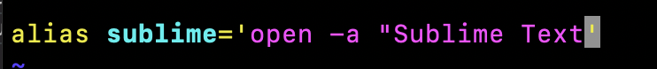

There's a bunch of other things you can do in .bash_profile, such as changing the terminal prompt and changing the colors of text. However, I'll leave these as an exercise to the reader to explore.

### Key Bindings

There are a couple of key bindings that exist in Bash that are useful to know. To see a list of all of them, use the command `bind -P`. I have highlighted a couple of useful ones below:

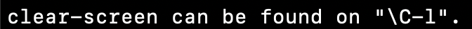

- Instead of typing `clear`, you can instead type Ctrl-l.
- Ctrl-a moves the cursor to the beginning of the line.
- Ctrl-e moves the cursor to the end of the line.
- Ctrl-r does a reverse search for the previous commands you have typed. Once you type a few letters of the command, it will fill in the rest with the most recent command you typed that starts with those letters. You can cycle through by again typign Ctrl-r.

### Shell Customization

Finally, I want to end off this section of some customization you can do beyond what Bash provides to us by default. Actually, this won't be in Bash at all, but in Z Shell (zsh), which allows for a lot more customization. Since they're both Unix shells, the syntax is all the same.

[How to install zsh](https://github.com/ohmyzsh/ohmyzsh/wiki/Installing-ZSH)

One really cool, community driven framework for zsh that I want to bring your attention to is [**Oh My Zsh**](https://ohmyz.sh/). Using this framework, there are a bunch of themes you can install to make your terminal ~pretty~, as well as special plugins that will streamline your development process a lot.

One example of this is when you double-tap tab to autocomplete, not only will it show you the files/directories in the directory that you could complete it with, but it also allows you to cycle through them using the arrow keys and select which one to autocomplete with by pressing Enter.

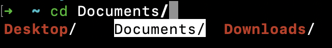

By default, zsh comes with the git plugin pre-installed. For those of you who are familiar with git, zsh helps a lot because it shows you what branch you are currently in, for a directory initialized with git. There are also shorthands for git expressions. For example:
- `git status` -> gs
- `git add --all` -> gaa
- `git commit -m "commit message"` -> gcmsg "commit message"

Further customization can be done in the ".zshrc" folder in your home directory. Here, you can add further themes or plugins. Some plugins I've added that I have found useful are [zsh-syntax-highlighting](https://github.com/zsh-users/zsh-syntax-highlighting) and [zsh-autosuggestions](https://github.com/zsh-users/zsh-autosuggestions).

What zsh-syntax-highlighting does is that for every valid command you type, it will highlight it in green. However, if it does not recognized it (i.e. you made a typo), it will be highlighted in red.

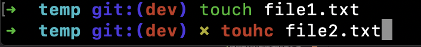

zsh-autosuggestions does what Ctrl-r does, but *better*. Instead of having to reverse search through commands, once you start typing, it will automatically provide a suggestion based on your recent commands. If you would like it to autocomplete, you simply press the right arrow key.

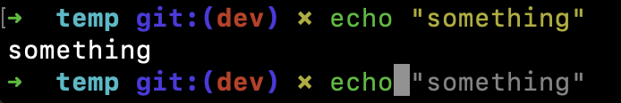

## 
Shell Scripting

## 
What you can do with shell scripting

