LaTeX (pronounced LAH-tekh or LAY-tekh) is a document preparation system.
The document preparation system that you have used before is probably
Microsoft Word or Google Docs. These word processors are classified as "What
You See Is What You Get" (WYSIWYG). However LaTeX follows the philosophy that the writer should only care about content and not worry about formatting. LaTeX will handle formatting. With LaTeX, one will edit the
document in plain text (like in a code file), and through the LaTeX software,
you can generated formatted documents in different formats such as PDF. Other
examples of non-WYSIWYG document processor are HTML and Markdown.

Therefore, a LaTeX document is comprised of 2 plain text parts, data (the
text you wanna show) and commands (tell the LaTeX program how to format your
document). However, on Google Doc, you only type in the data and uses the
software's graphical interface (buttons) to format your document. The format
is expressed not directly in terms of plain text, but in terms of the
appearance.

<div align=center>
  
</div>

## History of LaTeX

Before we get into the history of LaTeX, we first need to know the history of
TeX. 

A long long time ago (1960-1970s), in a far far place a way (the US), a
legendary computer scientist named Donald Knuth decided to write a book
titled "_The Art of Computer Programming_". He published Volume 1 and 2, and
was revising Volume 2 of the book. When the publisher gave Knuth a sample of
the second edition of Volume 2:

> __Publisher__: We have a new typesetting system and here is a new sample of
it! 
>
> __Knuth__: No.

Knuth didn't like quality of the new typesetting system, and decided to spend
6 months (which turns out to be 10 years) to create a new program that allows
scientists to typeset their book on a computer. This program is called TeX.

It takes in data and command to produce a formatted documents. The commands
are very low level (skip so much space, change to font X, set this string of
words in paragraph form, …), which makes document formatting a lot more
flexible and customizable but it sacrifices the ease of use. 

Then, LaTeX was born, created by another legendary computer scientist Leslie
Lamport. LaTeX is a set of macros defined using the lower level TeX commands.
It made document formatting easier, but at the same time still grants a lot 
of flexibility and control over the formatting. 

Just as a side note, here is an update on the progress of _The Art of
Computer Programming_.

<div align=center>
  
</div>

## Why Should You Use LaTeX?

Apart from looking cool, LaTeX is better than Microsoft Word or Google Docs
in several ways:
- Typesetting math is way easier
- You have full control over your document
- Citations and references are easier in LaTeX

## Overleaf: a Web-based LaTeX Workspace

> Overleaf, Online LaTeX Editor: https://www.overleaf.com/

In this workshop, we will be using Overleaf, a web application that allows
you to type document in LaTeX and viewing the formatted output in your
browser. With overleaf, you will not need to install any program to get LaTeX working, you only need a browser and internet connection.

Let's start a blank project, by clicking the _New Project_ button and choose
_Blank Project_. Give it a name. Since it is our first LaTeX document, I am going 
to use the name _Hello Latex_ (such creative much wow).

<div align=center>
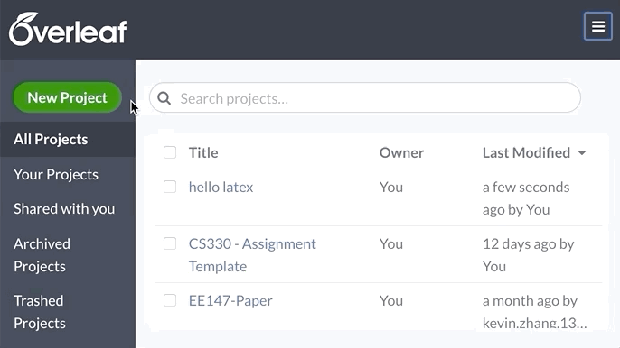
</div>

After you are done, you should get the following screen:

<div align=center>
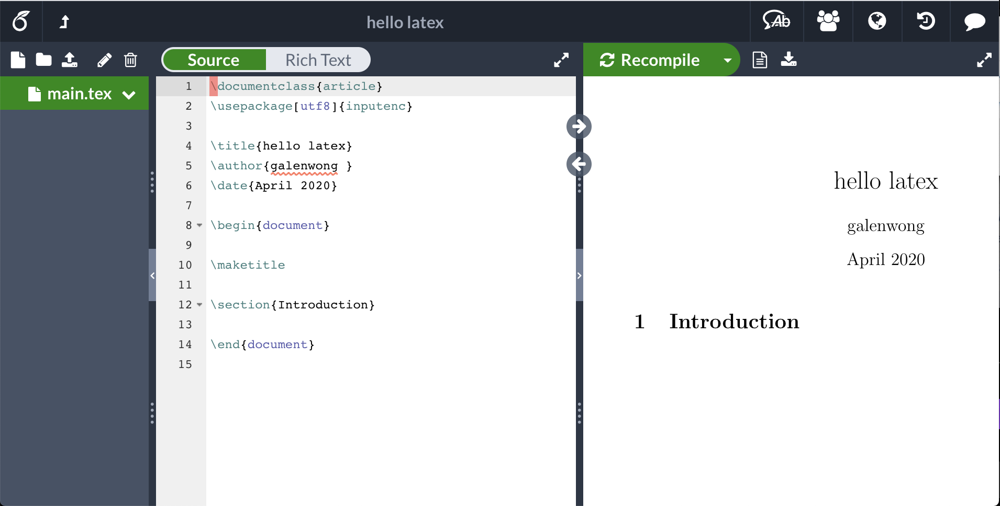
</div>

The interface is simple. On the left, it contains the list of file in this
current project. The middle column is a plain text editor that we will use to 
edit our LaTeX code. On the right, it is the formatted output. 

Let's remove everything in the document and start fresh.

## Structure of a Simple Document

We can start a simple document by just typing 

```tex
\documentclass{article}
\begin{document}
  Hello World!
\end{document}
```

Here, we already sees the most basic formats of LaTeX commands. They follow 
the following pattern:

```tex
\commandname{argument}
```

The first command `\documentclass{article}` specifies that this documents is
an article. LaTeX will put in some default formatting of the document based
on the argument of this command. Some other types of documents are books,
letter, exams, and even slides. Yes, you can write slides and exams in LaTeX
and some professors in UCLA actually do their slides and exams in LaTeX.

The next two commands are actually one pair of related command. This pair of
commands define environment, and the scope of this environment starts from
the `\begin` command until the corresponding `\end`. An environment is an area 
of the document where some formatting rules applies. If you are familiar with
HTML, this is like the beginning and closing tags.

All documents have to contains the `document` environment and all the data
(text you want to show) goes in there.

Something that most documents have is a title. LaTeX provides an easy creating a title. First, we tell LaTeX what information we want to display in the title like the actual title, author, and date. After, we can display the title with the `\maketitle` command.
```tex
\documentclass{article}
\title{Learning LaTeX}
\author{Timothy Rediehs}
\date{April 30, 2020}
\begin{document}
  \maketitle
  Hello World!
\end{document}
```

It's important to remember that the **`\maketitle` command is the only thing that went inside of the document environment.** We'll get the following result:

<div align=center>
  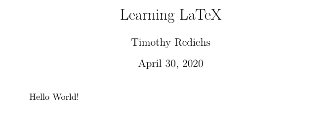
</div>

Another important thing here to note in LaTeX is the newline character. In
WYSIWYG processors, hitting enter means a newline is inserted into the
documents, or a new paragraph is being created. What happens if we type
newline in LaTeX? Let's change the content to:

```tex
\documentclass{article}
\begin{document}
  Hello World!
  This is the 2nd line.
  This is the 3rd line.
\end{document}
```

This is what we get: 

<div align=center>
  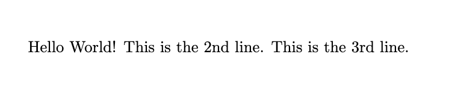
</div>

Then, how would we insert a newline than? The way to start a new paragraph
in LaTeX is to type 2 newlines, meaning that we leave 1 blank line between
paragraphs.

You can also specify a new line by typing `\\`.
```tex
\documentclass{article}
\begin{document}
  Hello World!\\
  This is the 2nd line.\\
  This is the 3rd line.

  This is the 2nd paragraph. One time Knuth decided to crosscompile his
  algorithms from binary to quaternary. In the process, he invented DNA.
  Knuth's brain is the most powerful source of energy known to man.
  Unfortunately, harnessing it would destroy mankind. Knuth recently created
  a new sorting algorithm. Its performance is O(1). Knuth can store all
  integers between 0 and 127 in 4 bits. Knuth invented binary.

\end{document} 
```
Result:

<div align=center>
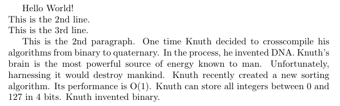
</div>

Yes, the paragraph are indented properly for you and indentation in the LaTeX
code does not reflect in the formatted document, except for some special
environment.

## Sections 

Let's start with something boring. Declaring section, I understand, it is not 
that exciting. We will get to the cool stuff later. 

To declare a section, we use the `\section{title}` and `\subsection{title}`
command. Let's add a few sections to our document.

```tex
\documentclass{article}

\begin{document}
  \section{Introduction}
  \subsection{Donald Knuth "Fun Fact"}
  Hello World!\\
  This is the 2nd line.\\
  This is the 3rd line.

  This is the 2nd paragraph. One time Knuth decided to crosscompile his
  algorithms from binary to quaternary. In the process, he invented DNA.
  Knuth's brain is the most powerful source of energy known to man.
  Unfortunately, harnessing it would destroy mankind. Knuth recently created
  a new sorting algorithm. Its performance is O(1). Knuth can store all
  integers between 0 and 127 in 4 bits. Knuth invented binary.

  \section{More \LaTeX}
  \subsection{How to Make Sections}
  We use the \textbackslash section and \textbackslash subsection command!
\end{document}
```


Result: 
<div align=center>
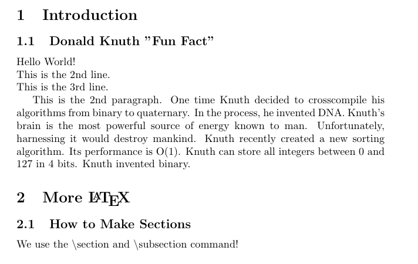
</div>

A few things that I would like to note here. First, notice how we never have
to specify the section numbering. LaTeX figured that out for us. This is good
since if we decide to insert a section in the middle latter, we wouldn't have
to renumber the section manually. Pretty cool huh?

Secondly, notice, we have a new type of commands! With the following format:

```tex
\command
```

This type of commands does not have any argument. They are usually used to
specify special characters. For example, since the '`\`' backslash character
is special in LaTeX to denote commands, to type the character we use a
special command `\textbackslash` instead. Note that you can use `\textbackslash{}` to get a space after the backslash which was omitted before. And there is a specialized command
called `\LaTeX` to produce an iconic formatting of the word LaTeX. It is a
way for LaTeX to flex its formatting flexibility. If you use this command,
people reading the document will for sure know that you are typing in LaTeX.

What? You think that the `\section` and `\subsection` commands are just
simple formatting command that changes the font size and bolds the text? You
are underestimating LaTeX's power. I shall now present you the **GREAT
POWER** of LaTeX.

However, in LaTeX, there is a great gotcha. See the quotes in the title of
subsection 1.1? In LaTeX, the quote characters, both the single `'` and the
double `"` quote, are interpreted as closing quotes. To type a opening single
quote, we use the backtick character `` ` ``, which should be located right
above you tab key on your keyboard. To type a opening double quote, type 2
backticks.

### Table of Content

Now, I present you a secret spell to summon a mysterious creature from the
meta-dimension in the LaTeX world. At the beginning of your document, type 
in the command 

```tex
\tableofcontents
```

Yes, this command summons the table of contents for you. You do not have to figure out the page number, the numbering, or the formatting. It is great.

## Math

After taking a glimpse at some of the LaTeX formatting power, we should take
a deep dive in what LaTeX is really well known for: typesetting math.
Let's first look at inline math. If you want to include some math inside
your text, you mark the math with the dollar sign '`$`'. For instance, 

```tex
This is the Pythagorean theorem: $a^2 + b^2 = c^2$. It is very cool.
```
Result:
<div align=center>
  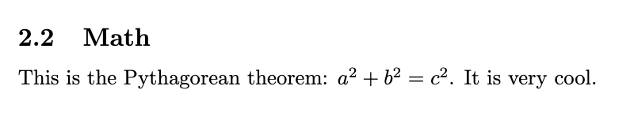
</div>

And yes, if you want to superscript some thing ("a to the power of 2"), you
use the `^` caret character. To subscript something, we use the underscore 
character `_`. Example:

```tex
A function is linear if $f(a_1x_1+a_2x_2) = a_1f(x_1)+a_2f(x_2)$.
```
Result:
<div align=center>
  
</div>

Notice how we use `\{` and `\}` to type the braces. Again it is because that 
they are special within LaTeX. This is called escaping a character. You can do this with other characters with special meanings like `\^` and `\_`.
Sometimes, you would want a chunk of math equation that is not inline. 
We use a pair of delimiters: `\[` and `\]`.

```tex
Euler's formula is a mathematical formula in complex analysis that
establishes the fundamental relationship between the trigonometric
functions and the complex exponential function. Euler's formula states that
for any real number $x$:
  \[e^{i\pi} = cos(x) + i\sin(x).\]
```

Result:
<div align=center>
  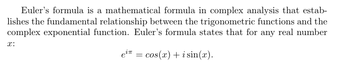
</div>

Again, a few more things to learn here:

- If we need to superscript more than 1 symbol, we need to use the braces to
group them together.
- We have access to special character like π through special commands. 
  A comprehensive list of all symbols can be found 
  [here](https://oeis.org/wiki/List_of_LaTeX_mathematical_symbols).
- There is a difference between `cos` and `\cos`. LaTeX will interpret `cos` as 
  3 variables `c`, `o` and `s` multiplied together. To actually type the trig 
  functions, we usually use `\cos`, and `\sin`. You can notice the formatting 
  difference.

Let's define a fraction. 

```tex
  The Taylor series for the exponential function ex at a = 0 is

  \[
      \sum_{n=0}^\infty \frac{x^n}{n!} 
      = \frac{x^0}{0!}+\frac{x^1}{1!} + \frac{x^2}{2!} + \frac{x^3}{3!} 
      + \cdots
  \]
```
Result:
<div align=center>
  
</div>

We define a fraction using `\frac{nominator}{denominator}`. Now, we have seen
another type of command format that one command can take more than one
arguments.

```tex
\command{arg1}{arg2}
```

## Using Packages

Again, LaTeX has already defined a pretty comprehensive set of commands over
the lower level TeX. However, sometimes the thing that we want to format is
just a tiny bit too complex. For instance, how do we format a matrix in a
document? A matrix is really complex and its pattern differs from the normal
line-by-line text that we are used to. 

To solve these problems, people have defined their own macros over LaTeX to
handle complex formatting. They bundle a set of macros together and publish
them together in a package. To use other people's package, you would normally
download and install them. However, on Overleaf, there are already a lot of
packages that came installed.

To use a package, we use the command `\usepackge{name}`. One of the package 
that provides a lot of math related functionalities is called `amsmath` named after the American Mathematical Society.

```tex
\documentclass{article}

\usepackage{amsmath}

\begin{document}
  % Your document ...
\end{document}
```

Notice that we placed the `\usepackage` command outside of the `document`
environment since importing packages do not belong to your text and data.
The package `amsmath` provides some handy environment for us to format our 
matrices. 

```tex
How about some linear algebra? The set of all 2 by 2 rotation matrices is 
defined as such:
\[
  \left\{ 
  \begin{pmatrix}
      \cos\theta & -\sin\theta \\
      \sin\theta & \cos\theta
  \end{pmatrix}
  : 0 \leq \theta < 2\pi
  \right\}.
\]
```
Result:
<div align=center>
  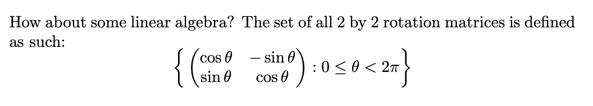
</div>

We use the `&` ampersand character to indicate the next item in a row and 2
backslashes `\\` to indicate a new row. The `\left` and `\right` commands 
automatically resize the next character to properly enclose the middle text 
so we get the big curly braces. The big parentheses is formatted big the 
`pmatrix` environment so we don't have to specify it.

### Google, Google, Google. Then Practice, Practice, Practice!

Even though LaTeX had already made its command as easy to understand as
possible, it can still be hard to type set something you want exactly. And
there will always be cases that you do not know how to do. Do not afraid,
just Google. I would say I cannot write LaTeX without having access to the
internet.

Then, it really comes down to practice to get yourself familiarized with how
to type math in LaTeX. Go find a math textbook, start recreating the equation
on there! Here is some exercise for you.

#### Exercise 1: Maxwell's Equations

Recreate the following 4 equations in LaTeX.

<div align=center>

</div>

<details>
<summary>
Exercise 1 Solution
</summary>

```tex
  \[
      \nabla\cdot\mathbf{E} = \frac{\rho}{\epsilon_0}
  \]
  \[
      \nabla\cdot\mathbf{B} = 0
  \]
  \[
      \nabla\times\mathbf{E} = -\frac{\partial\mathbf{B}}{\partial t}
  \]
  \[
      \nabla\times\mathbf{B} 
      = -\mu_0\left(\mathbf{J}
      + \epsilon_0\frac{\partial\mathbf{E}}{\partial t}\right)
  \]
```

</details>

#### Exercise 2: Derivative of Cosine with Euler's Formula

Recreate the following proof of the derivative of cosine.
Hint: Google what does the `align*` environment does.

<div align=center>
  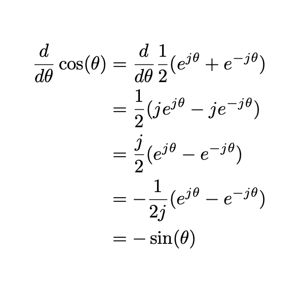
</div>

<details>
<summary>Exercise 2 Solution</summary>

```tex
\begin{align*}
  \frac{d}{d\theta}\cos\theta
  &=\frac{d}{d\theta}\frac12(e^{j\theta} + e^{-j\theta})\\
  &=\frac12(je^{j\theta}-je^{-j\theta})\\
  &=\frac{j}2(e^{j\theta}-e^{-j\theta})\\
  &=-\frac1{2j}(e^{j\theta}-e^{-j\theta})\\
  &=-\sin\theta
\end{align*}
```
</details>

## LaTeX for Things Other than Math
LaTeX is a general formatter and can be used to format anything. It is
particularly good at math but also other stuff. Here is some other things
that you can do in LaTeX.

  - Auto syntax highlighting of code: [minted](https://www.overleaf.com/learn/latex/Code_Highlighting_with_minted)
  - Drawing Chemical Molecules: [chemfig](https://www.overleaf.com/learn/latex/chemistry_formulae)
  - Drawing Anything: [tikz](https://www.overleaf.com/learn/latex/LaTeX_Graphics_using_TikZ:_A_Tutorial_for_Beginners_(Part_1)%E2%80%94Basic_Drawing)

There are a whole lot more cool packages and functionality of LaTeX waiting
to be discovered. When you think of something, just Google and see if there
is already a package there to support it.

Here're some useful packages for getting started:

- Amsmath: Useful for facilitating writing math equations
- Microtype: Subtly changes formatting and spacing to fit more onto a line/page
- hyperref: allows you to add hyperlinks to your document (this may be useful for references)


## LaTeX in Other Places

Now, LaTeX (and its underlying TeX engine) is a software but also the language
for typesetting math. This can be a way to communicate math on the internet.
LaTeX is therefore also supported on the web. For instance, all the math 
in stackexchange is formatted using LaTeX.

<div align=center>

</div>

You can also use LaTeX in piazza as well.

<div align=center>
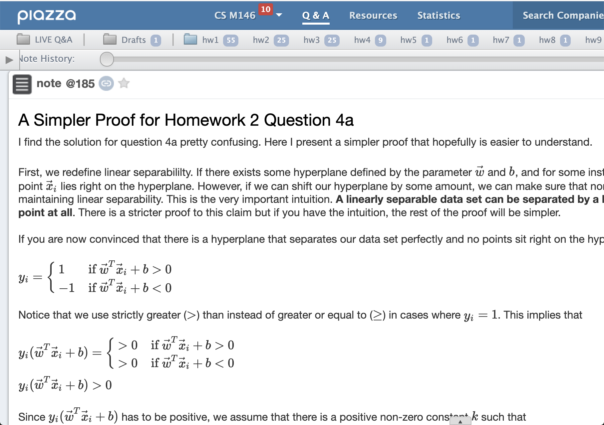
</div>

Using LaTeX in your Piazza makes your math more readable. If you are asking a
question this helps your classmates and TAs understand your question better.
If you answering a question, you answer is more readable as well.

If you are looking to integrate LaTeX into a website, I recommend you to 
look into [KaTeX](https://katex.org/). I personally use it in my 
[personal website](https://galenwong.github.io/blog/2020-02-08-nesterov-momentum-equivalence/) 
(shameless plug). 
