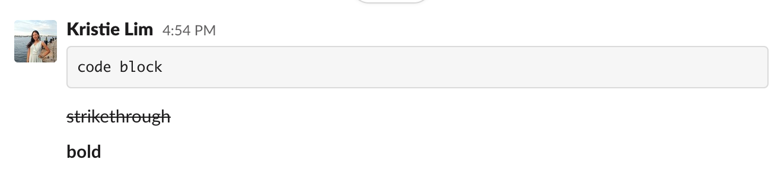
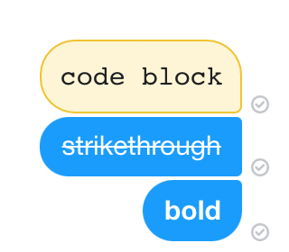
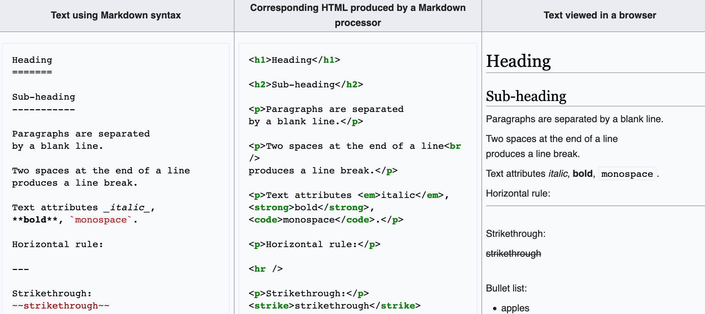
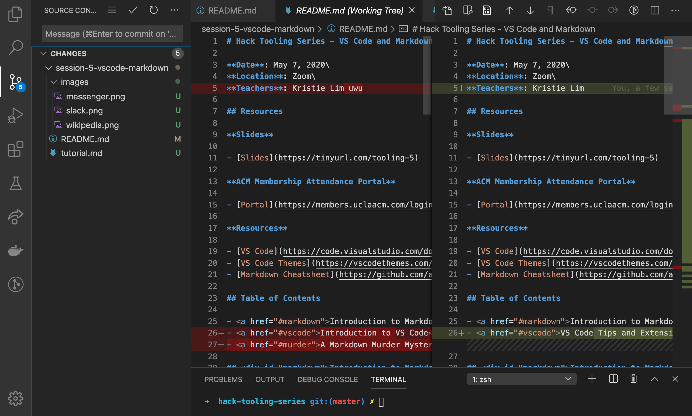
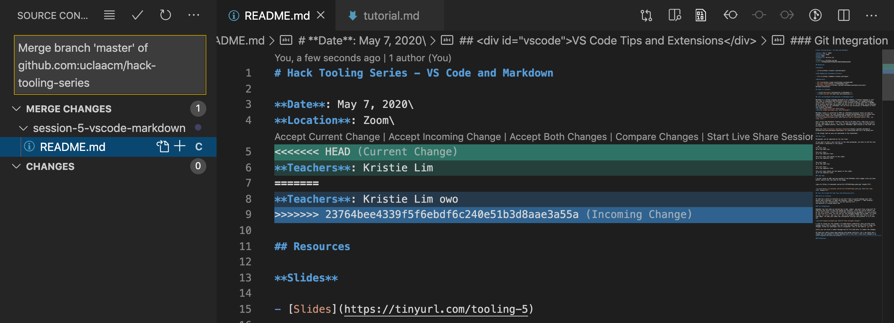
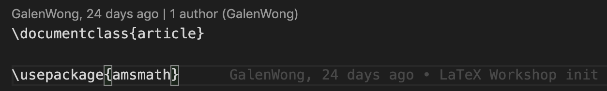
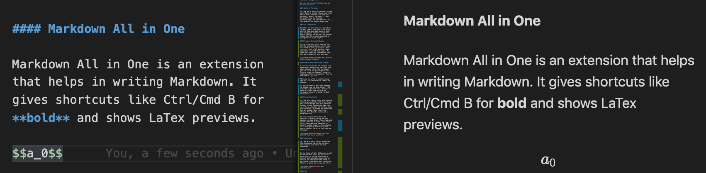

# Hack Tooling Series - VS Code and Markdown

**Date**: May 7, 2020\
**Location**: Zoom\
**Teachers**: Kristie Lim owo

## Resources

**Slides**

- [Slides](https://tinyurl.com/tooling-5)

**ACM Membership Attendance Portal**

- [Portal](https://members.uclaacm.com/login)

**Resources**

- [VS Code](https://code.visualstudio.com/download)
- [VS Code Themes](https://vscodethemes.com/)
- [Markdown Cheatsheet](https://github.com/adam-p/markdown-here/wiki/Markdown-Cheatsheet)

## Table of Contents

- <a href="#markdown">Introduction to Markdown</a>
- <a href="#vscode">VS Code Tips and Extensions</a>

## <div id="markdown">Introduction to Markdown</div>

Markdown is a markup language designed to be readable. A markup language is just text that is annotated with different kinds of formatting, for example marking certain text in italics. It's common to see software projects come with a README, which usually describes the project and how to run it. At ACM Hack, we use Markdown to write notes for our workshops! You can also use variations of Markdown in Slack and Facebook Messenger:



Markdown syntax is converted to HTML by a Markdown processor which can then be viewed in a browser for nice formatting. Viewing the Markdown file in Github also automatically shows with formatting and VS Code can show a preview as well.


Let's write some Markdown! Create a new file on VS Code (File > New File or Ctrl/Cmd N). Then save it as a `.md` file. To view the preview, press Ctrl/Cmd Shift-P to open the command palette. Then search "Markdown: Open Preview to the Side" and hit enter.

Check out [Adam Pritchard's Markdown Cheatsheet](https://github.com/adam-p/markdown-here/wiki/Markdown-Cheatsheet) for everything that we'll be going over.

A few things that we were not mentioned in the cheatsheet:

### New lines

Paragraphs can be separated by two new lines.

If you want to have a new line but in the same paragraph, you have to end the line with either a backslash or two spaces.

```md
This will show
up on the same line

This will show \
up on two separate lines

This will show (two spaces to the right)  
up on two separate lines
```

This will show
up on the same line

This will show \
up on two separate lines

This will show (there are two spaces to the right)  
up on two separate lines

### img tags

I prefer using an HTML img tag instead of the Markdown style images since you have better control over the size of the image.

```

```


## <div id="vscode">VS Code Tips and Extensions</div>

### Built-in Terminal

VS Code has a built-in terminal so you don't have to switch between your text editor and a terminal! To open the terminal, select "Terminal" > "New Terminal" from the top tab. Alternatively, use the shortcut Ctrl `\
The backtick is located above tab.

### Git Integration

Remember how last week we learned how to add, commit, and push files using git? VS Code also has tools to help you manage git projects. Click the source control tab on the left toolbar (looks like three dots connected by squiggles) in a git project.

#### Viewing Unstaged Changes

If you click on a file, you can see all the unstaged changes you've made. It's kind of like `git status` and `git diff` but a lot prettier. Note that this is not VS Code magic. VS Code just takes the information from git and presents it in a nice way.



#### Adding and Committing Changes

I like to review all the changes I've made before committing. Once you know which changes you'd like to commit, you can click the plus sign on the file to stage the changes, either by individual file or altogether. This is the same as `git add`.

Then you can write a commit message and hit Ctrl/Cmd Enter to commit the changes.

If you're ready to push your changes to Github, you can also select "Push" from the triple dot menu. However, I tend to prefer pushing from the terminal, since it's easier to deal with errors.

#### Merge Conflicts

VS Code also really helps when dealing with merge conflicts. Let's say there was a line changed that was pushed to Github. I have changed the same line on my local computer but the two lines are different. My change was committed but not pushed. When I pull the changes from Github, I will get a merge conflict.

VS Code automatically shows the conflict in pretty colors and the options you can select. Then stage and commit the file as usual. I've tried this a few times and sometimes it doesn't update properly. The solution is to try opening and closing the source control tab or to just use the terminal.



### Extensions

VS Code also has a ton of extensions. The extensions tab is the one with four squares with three of them connected.

#### GitLens

On the topic of git, GitLens is a neat extension that tells you who wrote each line. If you're working on a project with multiple people and you want to ask the person who wrote a particular line about what's going on, this is a quick way to see who it is.



#### Vim

In our first tooling series workshop, we learned about vim. This is extension is for you if you <3 vim but also want to use VS Code. You can also customize the settings in VS Code settings.

#### Formatters

I'm a big fan of formatters, which automatically make your code conform to certain rules so it is nice and readable. A formatter for Javascript that I like is called Prettier. The Python extension has a Python formatter and other support for Python. Most popular languages have extensions that come with formatters.

After installing an extension with a formatter, I like adding the "Format on Save" and "Save on Focus Change" settings. To open VS Code settings, open the command palette with Ctrl/Cmd Shift-P. Search "Preferences: Open Settings (UI)" and hit enter.

Search for "Format on Save" and check the box. This means the formatter will run whenever you save.

Search for "Auto Save" and change it to "onFocusChange." This means whenever you click away from your current tab for example to run your program in the terminal, it will automatically save.

> There is also "Preferences: Open Settings (JSON)" which is nice for backing up your settings and you might see instructions in extensions that describe their settings in JSON format as well.

#### Markdown All in One

Markdown All in One is an extension that helps in writing Markdown. It gives shortcuts like Ctrl/Cmd B for **bold** and shows LaTex previews.



#### Live Share

Lastly, Live Share is an extension that helps you collaborate on code. It's like Google Docs where you can see what others are writing in real time. After installing Live Share, you'll get a new tab in the left toolbar with an arrow and a circle. There you can start a collaboration session. You will need to sign in either with GitHub or Microsoft.

When prompted, click "Open VS Code" and you will be redirected to VS code with a new collaboration session. Share the link with your collaborators! They will also have to sign in and be redirected to VS Code. If something goes wrong in the sign in process, just restart VS Code and click the link again. 

On the left, you should see the "Session Details." By default you'll be following the host of the session. Right-click the host and unfollow the host. 
