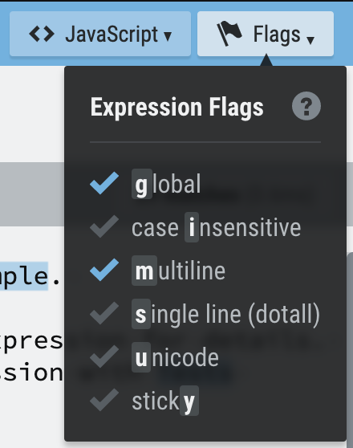
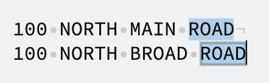
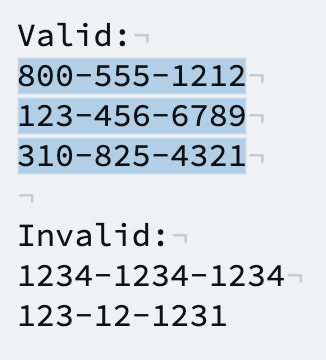
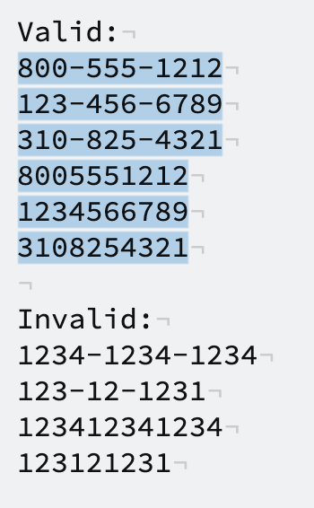
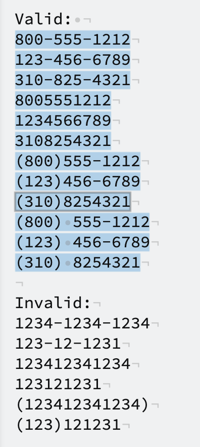
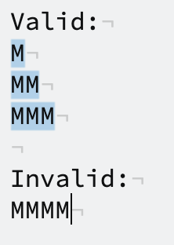
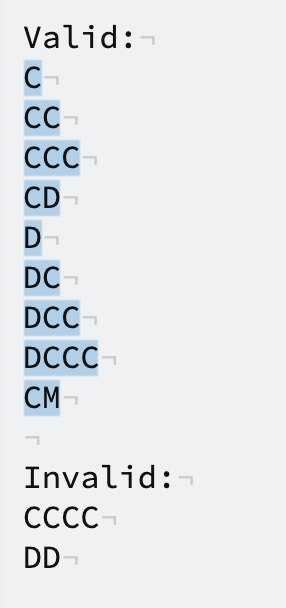
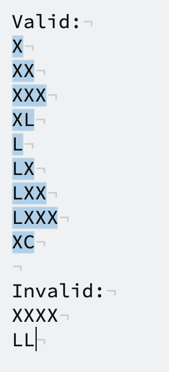
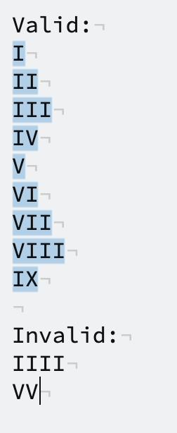
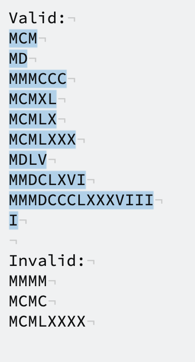

# Regular Expression Exercises

Copy the text boxes into https://regexr.com/ and write an expression according to the requirements. There are many possible expressions that could work, and the one that you should use depends on the actual use case. Since these are just examples, feel free to interpret the use case how you'd like.

If you use `^` (start of string) or `$` (end of string) make sure the multi-line flag is enabled. This is found in the "Flags" dropdown. 



## Street Addresses

Match any instance of "ROAD" that can be replaced with "RD":

```
100 NORTH MAIN ROAD
100 NORTH BROAD ROAD
```

Your expression should highlight like this:


## Phone Numbers

Match any phone numbers in this format:

```
Valid:
800-555-1212
123-456-6789
310-825-4321

Invalid:
1234-1234-1234
123-12-1231
```
Your expression should highlight like this:


Match the previous phone numbers and phone numbers without dash separators:

```
Valid:
800-555-1212
123-456-6789
310-825-4321
8005551212
1234566789
3108254321

Invalid:
1234-1234-1234
123-12-1231
123412341234
123121231
```
Your expression should highlight like this:


Match the previous numbers and phone numbers with the area code in parentheses:

```
Valid: 
800-555-1212
123-456-6789
310-825-4321
8005551212
1234566789
3108254321
(800)555-1212
(123)456-6789
(310)8254321
(800) 555-1212
(123) 456-6789
(310) 8254321

Invalid:
1234-1234-1234
123-12-1231
123412341234
123121231
(123412341234)
(123)121231
```
Your expression should highlight like this:


If you want to match any special character, you will need to escape it with a backslash.

- `\(` matches `(`
- `\.` matches `.`
- `\\` matches `\`

## Roman Numerals

A Roman numeral is made up of seven letters:
- I = 1
- V = 5
- X = 10
- L = 50
- C = 100
- D = 500
- M = 1000

A Roman numeral is composed of the thousands place, hundreds place, tens place, and ones place written left to right. For example, `XCIX` has nothing in its thousands place, nothing in its hundreds place, `XC` or 90 in its tens place, and `IX` or 9 in its ones place. So `XCIX` is 90 in Roman numerals. Our goal is to write an expression that matches any valid Roman numeral. 

Each place value has a limited set of strings that are valid and are given below. We will work up to the final result by finding expressions that match each place value and then combining them altogether at the end. 

Match the thousands place of a Roman numeral:

```
Valid:
M
MM
MMM

Invalid:
MMMM
```
Your expression should highlight like this:


Match the hundreds place of a Roman numeral:

```
Valid:
C
CC
CCC
CD
D
DC
DCC
DCCC
CM

Invalid:
CCCC
DD
```
Your expression should highlight like this:


Match the tens place of a Roman numeral:

```
Valid:
X
XX
XXX
XL
L
LX
LXX
LXXX
XC

Invalid:
XXXX
LL
```
Your expression should highlight like this:


Match the ones place of a Roman numeral:

```
Valid:
I
II
III
IV
V
VI
VII
VIII
IX

Invalid:
IIII
VV
```
Your expression should highlight like this:


Match any valid Roman numeral:

```
Valid:
MCM
MD
MMMCCC
MCMXL
MCMLX
MCMLXXX
MDLV
MMDCLXVI
MMMDCCCLXXXVIII
I

Invalid:
MMMM
MCMC
MCMLXXXX
```
Your expression should highlight like this:


These exercises are based off https://diveintopython3.net/regular-expressions.html. Read the full article for more complex and detailed information on Python regular expressions.