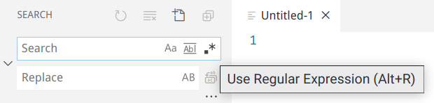
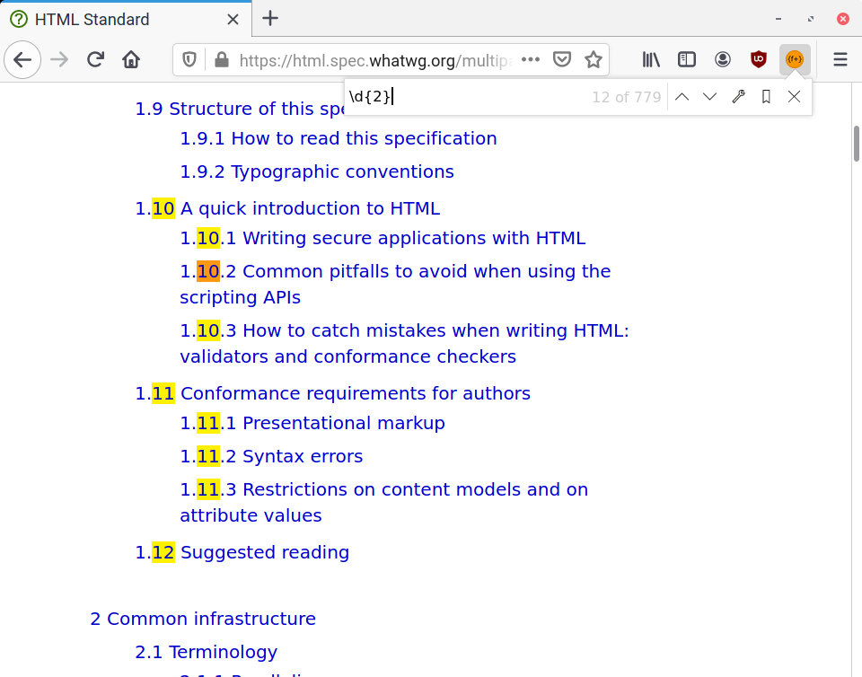
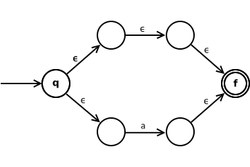
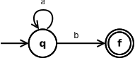

# Hack Tooling Series - Regular Expressions

**Date**: May 14, 2020\
**Location**: Zoom\
**Teachers**: Timothy Gu, Kristie Lim

## Resources

**Slides**

- [Slides](https://tinyurl.com/tooling-6)

**ACM Membership Attendance Portal**

- [Portal](https://members.uclaacm.com/login)

**Resources**

- [RegExr: A Regular Expression Tester](https://regexr.com/)
- [Cheatsheet](https://www.rexegg.com/regex-quickstart.html)
- [Dive Into Python RegEx Tutorial](https://diveintopython3.net/regular-expressions.html)

## Why Regular Expressions?

> It's interview time. You sit down in front the interviewer, and she says:
>
> > We have a list of dates, in the form ‘YYYYMMDD’. We need you to break it into three parts: year, month, and day.
>
> Confident in your programming experience in C++ (thanks to your education at UCLA), you write down the following code:
>
> ```c++
> std::optional<Date> ParseDate(const std::string& str) {
>   if (str.size() != 8)  // Invalid date; return null.
>     return std::nullopt_t;
>   Date date;
>   date.year = ParseNumber(str.data(), 4);
>   date.month = ParseNumber(str.data() + 4, 2);
>   date.day = ParseNumber(str.data() + 6, 2);
>   return date;
> }
> ```
>
> “Beautiful,” she says. “Now, let’s also accept two-digit years from some legacy systems of ours that’s still in use.” So we need to accept any date of the form (_YY_)_YYMMDD_, where () signifies something is optional.
>
> Easy-peasy, you think. You modify the code as follows:
>
> <details><summary>Code</summary>
>
> ```c++
> std::optional<Date> ParseDate(std::string str) {
>   if (str.size() != 6 || str.size() != 8)
>     return std::nullopt_t;  // Invalid date; return null.
>   bool short_year = str.size() == 6;
>   Date date;
>   date.year = ParseNumber(str.data(), short_year ? 2 : 4);
>   date.month = ParseNumber(str.data() + (short_year ? 2 : 4), 2);
>   date.day = ParseNumber(str.data() + (short_year ? 4 : 6), 2);
>   return date;
> }
> ```
>
> </details>
>
> But after writing this code down, we are starting to see complexity creep in, with the long list of `short_year ? … : …` expressions. But you know what, it still seems to work.
>
> Your interviewer now says:
>
> > Let’s also accept a time:
> > ```
> > (YY)YYMMDD( HH:mm)
> > ```
> >
> > As examples, we should accept both of these, as well as what we previously accepted:
> > ```
> > 20110102 03:04
> >   110102 03:04
> > ```
>
> Ugh, okay. Let's add more code. We can do this.
>
> <details><summary>Code</summary>
>
> ```c++
> std::optional<Date> ParseDate(std::string str) {
>   if (str.size() != 6 || str.size() != 8 ||
>       str.size() != 12 || str.size() != 14)
>     return std::nullopt_t;  // Invalid date; return null.
>   bool short_year = str.size() == 6 || str.size() == 12;
>   Date date;
>   date.year = ParseNumber(str.data(), short_year ? 2 : 4);
>   date.month = ParseNumber(str.data() + (short_year ? 2 : 4), 2);
>   date.day = ParseNumber(str.data() + (short_year ? 4 : 6), 2);
>   if (str.size() == 12 || str.size() == 14) {
>     date.hour = ParseNumber(str.data() + (short_year ? 7 : 9), 2);
>     date.min = ParseNumber(str.data() + (short_year ? 10 : 12), 2);
>   }
>   return date;
> }
> ```
>
> </details>
>
> Her response:
>
> > Great job. But we also have another challenge: our company has branches all over the world, and we need to take into account the time zone. In particular, we have some teams in India, whose [time zone](https://en.wikipedia.org/wiki/Indian_Standard_Time) is a half-hour time zone. So we need to accept anything of the form
> > ```
> > (YY)YYMMDD( HH:mm( UTC±TT(30)))
> > ```
> >
> > As examples, we should accept all of these, as well as what we previously accepted:
> > ```
> > 20110102 03:04 UTC+08
> >   110102 03:04 UTC+0530
> > 20110102 03:04 UTC-11
> > ```
>
> This interview just keeps getting worse. Hopefully this is the final task, and we'll be able to get the job right after.
>
> <details><summary>Code</summary>
>
> ```c++
> std::optional<Date> ParseDate(std::string str) {
>   if (str.size() != 6 || str.size() != 8 ||
>       str.size() != 12 || str.size() != 14 ||
>       str.size() != 19 || str.size() != 21 || str.size() != 23)
>     return std::nullopt_t;  // Invalid date; return null.
>   bool short_year = str[6] == ' ';  // ??
>   Date date;
>   date.year = ParseNumber(str.data(), short_year ? 2 : 4);
>   date.month = ParseNumber(str.data() + (short_year ? 2 : 4), 2);
>   date.day = ParseNumber(str.data() + (short_year ? 4 : 6), 2);
>   if (str.size() >= 12) {  // ??
>     date.hour = ParseNumber(str.data() + (short_year ? 7 : 9), 2);
>     date.min = ParseNumber(str.data() + (short_year ? 10 : 12), 2);
>     if (str.size() >= 19) {  // ??
>       date.timezone = ParseNumber(str.data() + (short_year ? 16 : 18), 2);
>       if (str.size() > (short_year ? 19 : 21))
>         date.timezone += 0.5; // ??
>     }
>   }
>   return date;
> }
> ```
>
> </details>
>
> What we see is that there are now magical constants everywhere, and the code is getting to the point where we can no longer extend or even read it.
>
> Just when you thought you are out of the woods, she says:
>
> > Okay, this will be the final challenge for you. Let’s also accept seconds in our time.
>
> This is the straw that broke the camel’s back. You can’t do it anymore. You walk out of the interview room in sadness.

This sad tale tells us that at some point, we can no longer use handwritten code to parse strings. If you had known enough about regular expressions, the interview process would have been a breeze. To start out, we could have used

```
[0-9]{8}
```

The `[0-9]` part means “any digit”, and the `{8}` means “repeated eight times.” This is enough to satisfy the very first prompt.

Well, this is cheating just a bit, as we don’t actually break the date into the three parts as we were asked to do. To fix this, we could separate the parts and give each one a name, using the special `(?<name>…)` syntax (called a “named capture group”):

```
(?<year>\d{4})
(?<month>\d\d)
(?<day>\d\d)
```

Note that here we used `\d`, which stands for “digit” and does the same thing as `[0-9]`.

To add support for shortened years, we make use of `?`, which means “optional”. Note that this is different from the `?` in the named capture groups we just saw.

```
(?<year>(\d\d)?\d\d)
(?<month>\d\d)
(?<day>\d\d)
```

Adding time support. We surround the added part with another pair of parentheses to say that the entire time component is optional.

```
(?<year>(\d\d)?\d\d)
(?<month>\d\d)
(?<day>\d\d)
( (?<hour>\d\d)
 :(?<min>\d\d))?
```

Adding timezone support:

```
(?<year>(\d\d)?\d\d)
(?<month>\d\d)
(?<day>\d\d)
( (?<hour>\d\d)
 :(?<min>\d\d)
 ( UTC
   (?<timezone>[+-]\d\d(\d\d)?)
   )?
 )?
```

----

Not only are regular expressions much shorter and more concise than the handwritten code, it’s also easier to modify and extend. There is no more mucking around with magic numbers: you can just tell the computer what you want, and the computer will “generate” the code for you.

## What Are Regular Expressions

Regular expressions (aka regexes, regexps) allow for **quick and easy string matching**. They are essentially patterns you tell the computer to recognize in text.

While they are initially popularized by Unix tools like `grep` and `sed`, they are now found everywhere, including in most programming languages. Here’s the regex-enabled Visual Studio Code search feature:



Here’s Mozilla Firefox’s FindIt addon, which allows searching through a web page using regexes:



## Common Regular Expression Techniques

- `.`: matches any letter
- `a`: matches the letter `a`
- `^` and `$`: matches the beginning and end of line, respectively
- `a*`: matches zero or more letters `a`
- `a+`: matches one or more letters `a`
- `a?`: matches zero or one `a`
- `a{n,m}`: matches between n and m occurrences of `a`
- `[a-z123]`: matches a lower-case letter, or `1`, or `2`, or `3`
- `abc|def`: matches `abc` or `def`
- `a(bc|de)f`: matches `abcf` or `adef`

## Theory

Believe it or not, regular expressions are one of the crowning achievements in computer science as an academic field of study. What's so fascinating about them is that despite their incredible power, **every regex can be implemented in linear time\*.** This is done by transforming a regex to an equivalent _finite-state automaton_.

But what is a finite-state automaton?

\* The fine print here is if we restrict ourselves to the POSIX BRE/ERE flavor of regexes.

----

Turns out, a finite-state automaton is a combination of these things:

- A mouse
- A maze with a few designated starting points
- Cheese at one or more locations in the maze

For instance, here is a finite-state automaton:


Locations with double circles are places with cheese, and the location with sourceless arrows pointing at them is the start location, or start state.

The goal for the mouse is of course to **find the cheese**.

Let’s now look at different parts of mazes.

### Some Paths Have Tolls

To get through some paths in the maze like the one displayed above, the mouse has to give out one of its most prized possessions: a computer character. In the example above, the mouse has to provide an `a` in order to get to the cheese. This FSA actually represents the regular expression `a`: we can think of the event where the mouse successfully gets to cheese as the event where the regular expression matches the provided text.

### Other Paths Are Freeways

If the path is marked with an epsilon (ε), then it is called an ε-move. ε-moves are free: the mouse can go through it without having to give a character:


### Matching Something _and_ Something Else

If we put two things one after another, then the mouse has to provide two characters in order. This FSA represents the regular expression `ab`:


### Matching Something _or_ Something Else

We could give the mouse a choice using the following construction. This automaton represents the regular expression `[ab]` or `a|b`. We assume that the mouse quite cunning in that it can always pick the best path at any point.


### Challenge: Matching Zero or One (`?`) of Something

Here's a challenge. Can you make a FSA/maze for the regular expression `a?`?

<details><summary>Answer</summary>

It turns out to be quite simple. We just replace one of the branches in the regular expression for `a|b` to be an ε-move, as `a?` is equivalent to `a|` – `a` or nothing.



But we also see that there are many ε-moves in this maze, which seems to be much ado about nothing. Can we simplify it somehow? Indeed we can.


</details>

### Repetition: The `*` Quantifier

With some cleverness, we can also create mazes for `*`. This automaton represents the regular expression `a*b`.



### Challenge: The `+` Quantifier

Here's another challenge. How do you create an automaton that matches the regular expression `a+b`? Hint: it'll look quite similar to what we just saw.

<details><summary>Answer</summary>


</details>

### Regular Expressions and the Turing Award

Rabin and Scott (1959) proved that modern computers can be very efficient in finding cheese in these mazes. They did so by reducing any finite-state automaton to a more restricted form called a _deterministic finite-state automaton_, or DFA, that we have known to be quite efficient. A DFA is a finite-state automaton

- without ε-moves, and
- there is at most one arrow from a location to another with the same marking.

They were awarded a Turing Award for this discovery, by the Association of Computing Machinery.

## Mini Project

Get a playlist of youtube links from your Facebook messages to someone! Try to write your own program first, but a sample python implementation is found in `get_youtube_links.py`.

A sample set of messages is found in `messages.json`. There are 7 links you can try to match there.

If you want to do this with your own Facebook messages, go to "Settings" > "Your Facebook Information". Then click "Download Your Information." Uncheck everything except messages. Choose your preferred date range, JSON format and low media quality. After requesting, you can go to the "Available Copies" tab to see your pending copy. It will take some time before it is available.

This mini project is based off of https://medium.com/@julianknodt/converting-fb-messages-into-a-youtube-playlist-using-nodejs-aba60156ea72.
